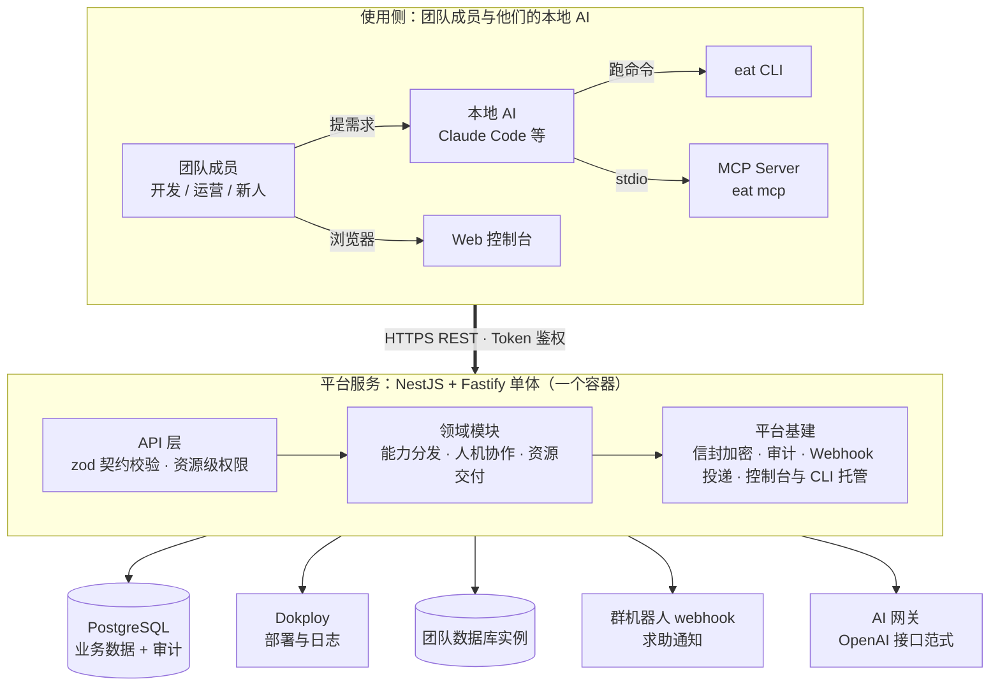

# easy-agent-team

面向团队的 **AI 能力集中管理与分发平台**。

少数「能力建设者」负责开发 Skill、配置 MCP、维护环境与基础设施，平台负责把这些能力在**权限管控**下分发给团队里的其他成员——包括不懂技术的同事。同时提供一套「人机求助」机制：AI 遇到搞不定的问题可以向团队里的人求助，求助的答案还能沉淀为可复用的 Skill 经验。

## 解决的问题

1. **人人都能靠 AI 把项目做出来并跑起来**（最核心的一点）：团队里的**任何**成员——包括完全不写代码的同事——都能借助自己的 AI 独立完成项目开发与上线运行。Skill、MCP 配置、环境变量、数据库账号、部署能力全部由平台按权限自动下发到本地 AI 手里，成员不必自己搭环境、不必满群找密钥、不必申请运维资源、不必等别人有空；卡住时 AI 还能直接向懂的人求助。
2. **集中管理**：Skill、MCP 配置、环境变量、数据库账号、部署能力，统一收口，不再散落在各人本地。
3. **权限管控**：资源级授权、元数据可见 + 取值受控、申请审批流、审计日志。
4. **能力分发**：角色模板一键套用，CLI / MCP 自动同步到本地 AI 工作环境。
5. **人机协作求助**：AI 主动求助真人、答案沉淀为经验 Skill，知识在团队内滚雪球。

## 架构图



- **单体 + 单库**：REST API 与后台工作都在同一个 NestJS 进程里，业务数据与审计全落一个 PostgreSQL——不引入 Redis、不起独立 worker。控制台构建产物由后端静态托管，部署仍是一个容器。
- **三端一套契约**：请求/响应用 zod 定义在 `packages/shared`，server 校验、CLI 与前端复用同一份类型，三端类型一致由编译器保证。
- **AI 是一等用户**：面向人的能力都有对应的 MCP 工具，AI 可以自助完成，无需人转述。
- **元数据公开、取值受控**：AI 默认能看见「有哪些配置、各是干什么的」，但取值需要授权；无权限时返回可执行的申请引导，而不是无声失败。

## 功能清单

### 用户与认证

| 能力 | 说明 |
|---|---|
| 账号与角色 | 管理员 / 成员两级平台角色 + 资源级 Owner，不引入复杂 RBAC |
| 用户管理 | 建号、改角色、禁用/启用、重置密码；禁用与改密即时吊销该用户全部 Token |
| 开放注册 | 管理员开关 + 允许的邮箱后缀白名单，注册即登录、无审批流 |
| 设备码登录 | `eat login` 出码 → 浏览器授权页确认，CLI 凭证落 `~/.eat/credentials.json` |

### 环境变量

| 能力 | 说明 |
|---|---|
| 两级结构 | 环境（如 `internal-api`）+ 变量；变量元数据（key、用途备注）默认对全员可见，也可逐个变量关掉 |
| 敏感 / 非敏感 | 敏感值信封加密存储（AES-256-GCM + KEK）；非敏感值明文存储，有读取权限者清单/控制台直接可见 |
| 资源级授权 | 授权到「用户 × 单个变量」或「用户 × 整个环境」，可设有效期，Owner 与管理员可管 |
| 申请审批 | 无权限拉取时引导发起申请，Owner 审批；CLI / MCP / 控制台三端可查状态 |
| 取值下发 | `eat env pull` 按权限拉取并写入 `./.env` |
| 读取审计 | 敏感值的每次读取落审计日志 |

### Skill 管理与分发

| 能力 | 说明 |
|---|---|
| 纳管与版本 | `eat skill push` 上传，首次创建、再次推送服务端自动出新版本 |
| 可见性与订阅 | 三档可见性（团队可见 / 授权可见 / 私有）控制谁能看到；成员订阅后随同步落地 |
| 本地同步 | `eat sync` 实际文件落 `~/.agents/skills/`，逐个软链到 `~/.claude/skills/`（Windows 改为复制实文件） |
| 安装范围 | 默认装全局，也可只装到当前项目（`./.agents/skills/` + 相对软链）或指定自定义目录 |
| 内置平台指南 | 每个成员自动注入 `eat-platform-guide` Skill 并排在首位，让本地 AI 认识平台能力与正确用法 |
| 更新提示 | 服务端在响应头搭车下发 CLI 版本与 per-user Skill 指纹，CLI / MCP 侧提示「有新版」；`eat self-update` 一条命令升级 |

### MCP 配置分发

| 能力 | 说明 |
|---|---|
| 集中维护 | 管理员统一维护 MCP server 配置，成员订阅后随 `eat sync` 落地 |
| 密钥占位符 | 配置里写 `${env:环境/KEY}`，下发时按该成员的权限渲染，无权限不下发明文 |

### 角色模板

| 能力 | 说明 |
|---|---|
| 能力套餐 | 管理员预定义「一组 Skill + MCP 配置 + 环境引用」 |
| 一键套用 | 成员选中模板即批量订阅，新人入职当天就能开工 |

### 求助系统（人机协作）

| 能力 | 说明 |
|---|---|
| 两类入口 | 向**具体的人**求助，或向某个 **Skill 的作者**求助（AI 按能力描述自己选） |
| 可求助登记 | 用户自助登记能力描述 + 接收求助 / 接收回复两个开关 |
| 飞书通知 | 飞书群自定义机器人 webhook（支持加签，密钥由用户粘贴），消息是卡片：含「查看请求」按钮与「发送给 Agent」代码块 |
| 多轮对话 | 求助 → 回复 → 追问 → 标记解决，CLI / MCP / 控制台三端都能读写 |
| 防骚扰 | 每用户每小时求助次数限流（可配，见 `EAT_HELP_RATE_LIMIT`） |

### 经验沉淀

| 能力 | 说明 |
|---|---|
| 经验即 Skill | 求助解决后由平台 AI 把对话整理成结构化经验，以 Skill 形式分发订阅 |
| 自助检索 | AI 可以先检索经验库，同样的问题不问第二遍 |

### 数据库账号分配

| 能力 | 说明 |
|---|---|
| 实例登记 | 管理员登记团队数据库实例，管理员凭证加密存储 |
| 真实建库建号 | 成员申请 → 审批 → 平台在实例上真实建库、建专属账号并授权（PostgreSQL） |
| 凭证下发 | 凭证自动生成为一组环境变量，仅 `DB_PASSWORD` 敏感，整组默认只授权给申请人 |

### 部署托管（Dokploy）

| 能力 | 说明 |
|---|---|
| 项目挂载 | 建项目时可直接从 Dokploy 搜索选择已有应用，Dokploy 未配置时降级为手填 |
| 成员管理 | 项目成员制，日志与部署权限收敛到成员并落审计 |
| 部署门禁 | `eat deploy` 先在本地做密钥扫描（通用规则 + **平台密钥指纹匹配** + `.env` 误提交），报告随部署请求上送，不通过不部署；还可选配一条本地预跑命令，非零退出即拦下 |
| 状态透传 | 部署记录与状态一律以 Dokploy 的构建记录为准，平台库只存它没有的业务元数据（谁触发的、带了什么扫描报告）；失败时把构建日志末尾直接写进错误，平台里就能看到真实报错 |
| 绕过可见 | 有人直接在 Dokploy 侧触发的部署也会列在部署历史里并标注「未经平台密钥扫描」——门禁被绕过这件事因此看得见 |
| 历史留存 | Dokploy 每个应用只保留最近 10 次构建记录，平台侧元数据只增不删，`--all` 可回看被清理的那些是谁触发、带了什么报告 |
| 日志读取 | 构建日志（部署失败先看它）与容器运行日志（构建成功但服务不正常时看它），CLI 与控制台都能读 |

**Dokploy 版本要求：建议 v0.25.0 及以上。** 平台在触发部署时会把一个 `eat:<id>` 标记写进 Dokploy 构建记录的
`description`，读取时靠它精确认出「这条构建记录属于哪次平台部署」——`application.deploy` 的 `title` / `description`
两个入参**从 v0.25.0 才有**，v0.24.0 及更早的版本只接受 `applicationId`，多传的键会被静默丢弃（不报错）。

在更老的版本上平台不会不可用，而是自动降级为**按触发时间就近推断**归属，并在 CLI 与控制台上把这条记录标注为
「⚠ 归属按时间推断」。这个降级有真实代价：同一个 Dokploy 应用被并发部署时（比如有人几乎同时在 Dokploy 控制台
点了一次），归属可能张冠李戴，把未经平台密钥扫描的部署显示成经过门禁的部署。**要让部署记录的归属可靠，请升到
v0.25.0 以上。**

另外两条与版本无关、但会影响使用预期的 Dokploy 行为：

- **每个应用只保留最近 10 条构建记录**，超出的连构建日志文件一起删除，且该数值在 Dokploy 里是硬编码、不可配置。
  这就是部署历史默认只有 10 条、更早的要用 `eat project deployments <project> --all` 从平台元数据看的原因。
- **v0.30.4 实测**：`project.all` 返回的应用条目不含 `appName` 与 `description`，因此控制台「从 Dokploy 选择应用」
  在该版本上**无法按容器名搜索**，只能按应用显示名与 application id 搜（清单本身正常可用）。

### 安全与审计

| 能力 | 说明 |
|---|---|
| 信封加密 | 敏感值 AES-256-GCM，KEK 走部署环境变量，不依赖外部 KMS |
| 明文不外泄 | 密钥永不下发给无权限方——包括错误消息、日志与 webhook payload（webhook 只带事件与链接） |
| 审计日志 | 敏感值读取、授权变更、审批决策、部署与日志读取全程留痕 |
| 本地扫描 | CLI 端扫描能识别出「这段字符串就是平台里的某个密钥」，防止密钥被提交进仓库 |

### 三端接入

上面各模块的能力，在三个入口上都能用：

| 入口 | 说明 |
|---|---|
| Web 控制台 | 管理、授权与审批的图形入口；桌面侧边栏 + 移动端抽屉布局，手机上也能用 |
| eat CLI | 成员与本地 AI 的主通道，命令按模块分组；完整命令与参数以 `eat --help` 为准 |
| MCP Server | `eat mcp` 起 stdio server，把平台能力做成工具交给本地 AI 自助调用；完整工具清单以 MCP 客户端里列出的为准 |
| CLI 分发 | 平台自托管、不发 npm registry：一条命令安装（见下方「快速开始」），版本天然与平台一致，升级即重装；macOS / Linux / Windows 全链路兼容 |

## 快速开始

```bash
pnpm install && pnpm build
pnpm db:migrate && pnpm db:seed      # 初始管理员 admin@example.com / admin12345
node apps/server/dist/main.js        # http://localhost:3000
node apps/cli/dist/index.js login    # CLI 设备码登录
```

团队成员安装 CLI（平台自托管分发，无需 npm registry；也可打开控制台「安装 CLI」页，把 Agent 安装指令一键复制给自己的 AI）：

```bash
# macOS / Linux / WSL / Git Bash
curl -fsSL http://<平台地址>/install.sh | sh
# Windows PowerShell
powershell -ExecutionPolicy ByPass -c "irm http://<平台地址>/install.ps1 | iex"

eat login --server http://<平台地址>
```

## 环境变量配置

配置项以 [.env.example](.env.example) 为准（复制为 `.env` 填写；`.env` 不入库，被平台的密钥扫描拦截，`.env.example` 除外）。三个必填项：

| 变量 | 说明 |
|---|---|
| `DATABASE_URL` | PostgreSQL 连接串，生产必须指向持久化实例 |
| `EAT_KEK` | 值加密主密钥，base64 的 32 字节：`openssl rand -base64 32`。**丢失即密文不可恢复，务必备份**；开发环境缺省用内置的不安全默认值 |
| `EAT_PUBLIC_URL` | 平台对外地址，设备码授权页与 webhook 链接以此拼接 |

其余均为可选项（服务端口、初始管理员、种子开关、求助限流等），默认值与说明都在 `.env.example` 里。

使用方式：Docker 用 `--env-file .env`；本地直跑用 `node --env-file=.env apps/server/dist/main.js`（Node 20.6+ 原生支持）。

## 部署

仓库根目录提供 `Dockerfile`（国内网络用 `Dockerfile_cn`，依赖走 npmmirror 源），详细步骤见[部署文档](docs/deployment.md)。

## 文档

- [产品设计文档](docs/product-design.md) —— 产品与技术设计的唯一事实源，含权限模型、数据模型、接口设计与全部决策记录。
- [部署文档](docs/deployment.md) —— 镜像构建、Dokploy 部署步骤、备份与 CLI 自举分发。
