# easy-agent-team

面向团队的 **AI 能力集中管理与分发平台**。

由少数「能力建设者」开发 Skill、配置 MCP、维护环境与基础设施，平台在**权限管控**下将这些能力分发给团队的其他成员——包括不具备技术背景的同事。平台同时提供「人机求助」机制：AI 无法自行解决的问题可以转交给团队中掌握相关信息的人，所得答复沉淀为可复用的 Skill 经验。

## 核心理念

AI 的能力边界往往不取决于模型本身，而取决于它在具体环境中能获取到什么。

团队里每个人负责不同的职责，不会拥有团队的全部业务上下文，也不应握有全部权限。因此 AI 在真实工作中会稳定地
遇到两类阻塞：

- **权限缺失**：所需的密钥、数据库与部署资源不在本地，需要向管理者申请。
- **信息缺失**：所需的业务上下文分散在他人或内部系统中，需要向了解的人求助。

以往这两类阻塞只能由人介入化解：使用者中断手上的工作，代替 AI 去申请与询问，再将结果转述回来。eat 把这一过程
交还给 AI 自行完成——发起授权申请、发起求助、获取答复，并将答复沉淀为可复用的经验供后续检索；人只需在各自的
职责范围内完成审批或回复。

第三类阻塞出现在交付的最后一公里。AI 让团队中的任何人都能快速做出一个网站或工具来支撑业务，但要真正投入使用，
仍需要一个数据库和一次上线。eat 同样覆盖这一段：任何成员的 AI 都能按权限获得专属数据库账号，自助创建应用并将其直接部署
上线，无需等待运维介入。

eat 的定位由此确定：作为 AI 与人之间的协作层，让权限、信息与基础设施在团队内按规则流动，而不是滞留在少数人手中。

## 解决的问题

1. **让每个成员的 AI 独立完成交付**：一名成员——即使不编写代码——从开发到上线所需的 Skill、MCP 配置、环境变量、数据库账号与部署能力，均由平台按权限直接下发至其本地 AI；缺少权限即时申请，缺少上下文即时求助，无需自行搭建环境、无需四处索取密钥、无需等待他人配合。
2. **集中管理**：Skill、MCP 配置、环境变量、数据库账号与部署能力统一纳管，不再分散于各成员本地。
3. **权限管控**：资源级授权、元数据可见 + 取值受控、申请审批流、审计日志。
4. **能力分发**：角色模板批量套用，CLI / MCP 自动同步至本地 AI 工作环境。
5. **人机协作求助**：AI 可主动向团队成员求助，答复沉淀为经验 Skill，团队知识持续累积。

## 长什么样

下面的截图与录屏来自同一份可复现的演示数据（生成方式见 [`scripts/demo/`](scripts/demo/README.md)）：
数据经平台自己的 API 写入，应用部署、构建日志、数据库账号都是真跑出来的，命令行录屏是把命令
真执行一遍录下来的，输出未经修改。完整全集见 [界面截图与录屏](docs/screenshots.md)。

### 一个新同事的一天，从命令行看

登录一次，团队的 Skill 与 MCP 配置就到本地了——包括那份内置的平台使用指南，
以及「哪些引用因为你没权限而没渲染出来、该怎么申请」。


缺权限不是静默失败：清单看得见、值看不见，平台直接给出该执行的申请命令；Owner 批完再拉一次就有了。

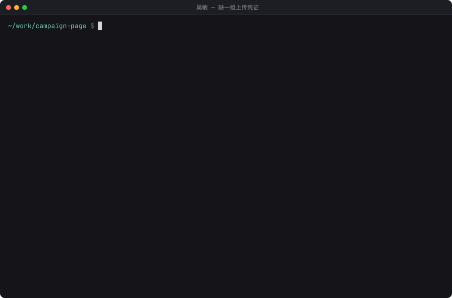

缺上下文也一样——AI 按能力描述自己挑该问谁，答复回来继续干活，事后还能沉淀成经验 Skill。

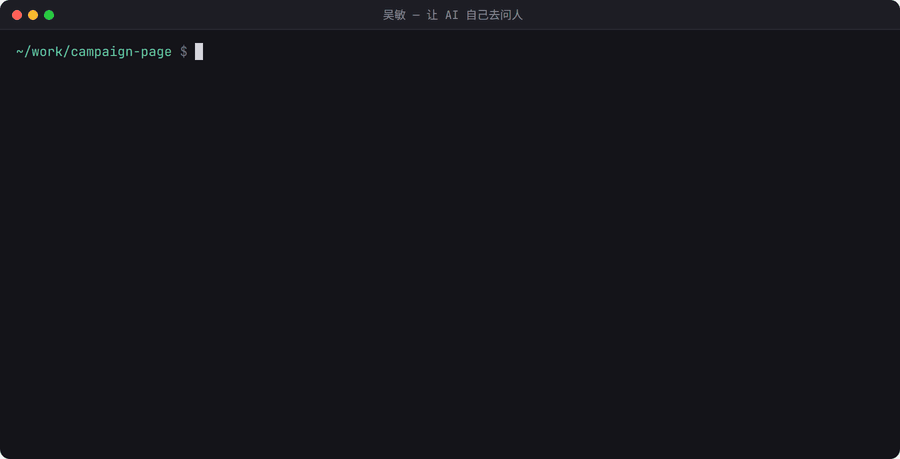

要上线时，本地先做密钥扫描：除了通用规则与 `.env` 误提交，还会拿文件里的字符串与**平台下发过的
密钥指纹**比对。没过就不部署。

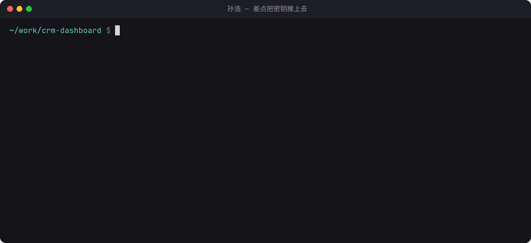

过了才触发部署，构建结果与容器日志都在平台里看（失败时长什么样见
[全集](docs/screenshots.md#部署失败真实报错就在平台里)）。

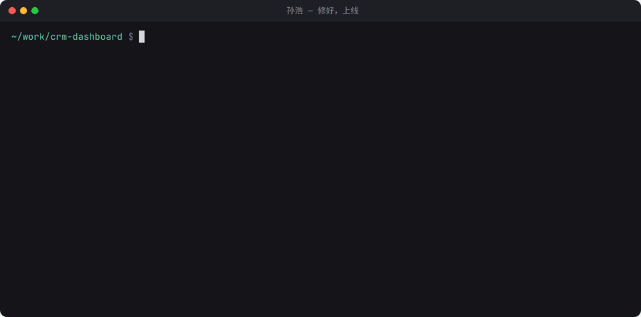

### 控制台

管理、授权与审批走网页。变量的 key 与备注默认全员可见，值需要授权；敏感值加密存储并打码，
非敏感值对有权限的人直接明文可见。

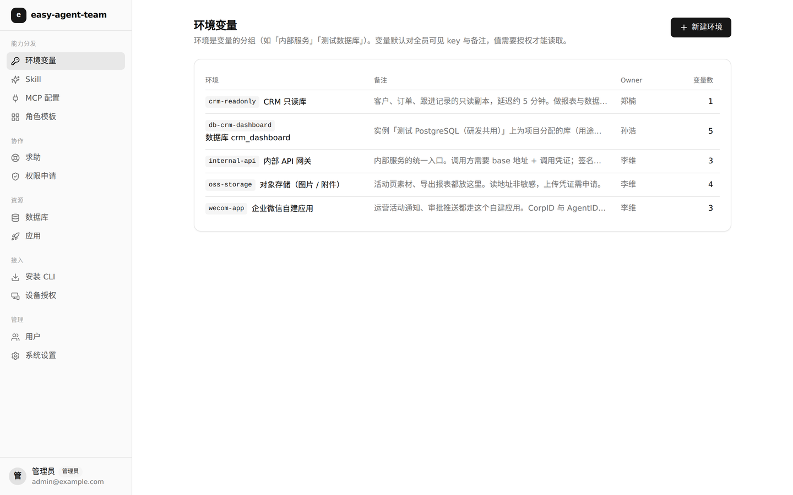

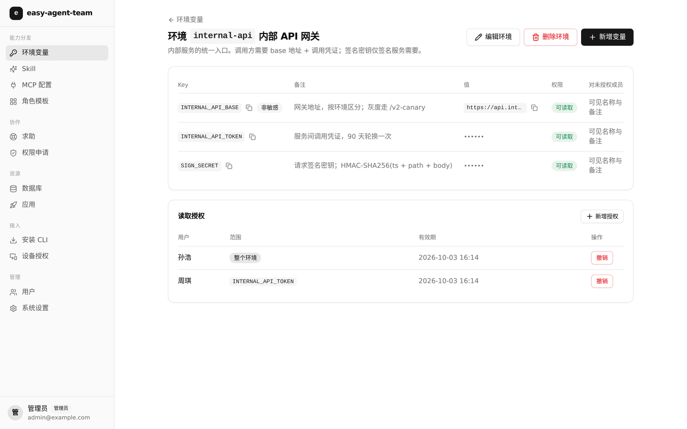

无权限的人发起申请，Owner 在这里批——也可以设个有效期。

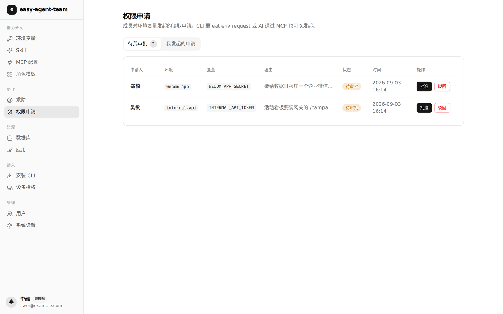

Skill 集中纳管、按可见性分发（团队可见 / 授权可见 / 私有），版本由服务端在每次推送时递增；
`exp-` 开头的是求助解决后沉淀下来的经验。内置的平台使用指南不占列表位，`eat sync` 时自动注入到每个人本地。

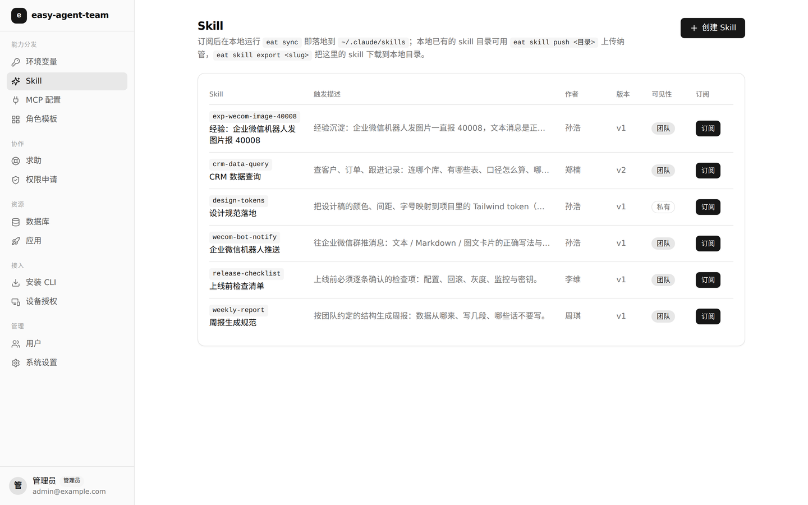

求助是多轮的，解决后可以一键整理成经验 Skill 继续分发。

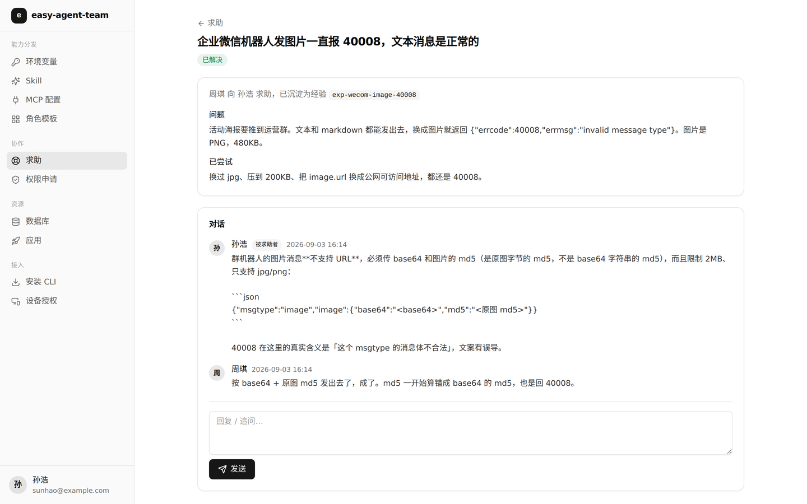

应用由成员自助创建（填 Git 地址与构建方式），首次部署需管理员授权一次；管理员配了域名后缀的话，
建应用时自动分配 `<slug>.<后缀>`。

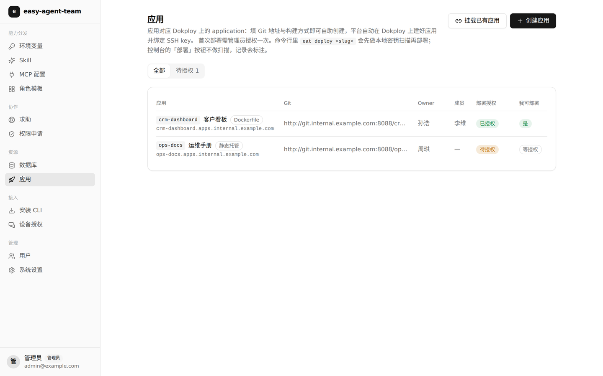

部署记录以部署后台的构建记录为准。这三条分别是：**直接在部署后台触发的**（标注「未经平台扫描」，
绕过门禁因此可见）、平台触发且成功的、平台触发但构建失败的。

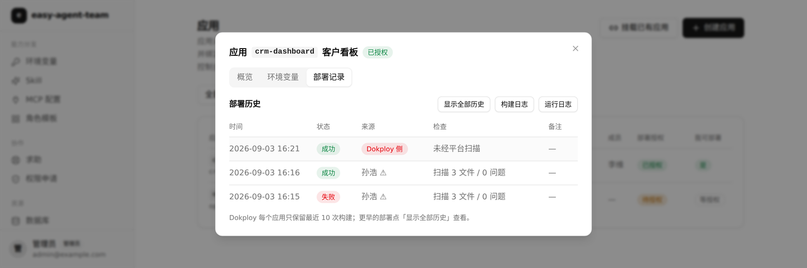

移动端同样可用：桌面是左侧分组侧边栏，手机换抽屉导航，表格按断点隐藏次要列。

<p>
  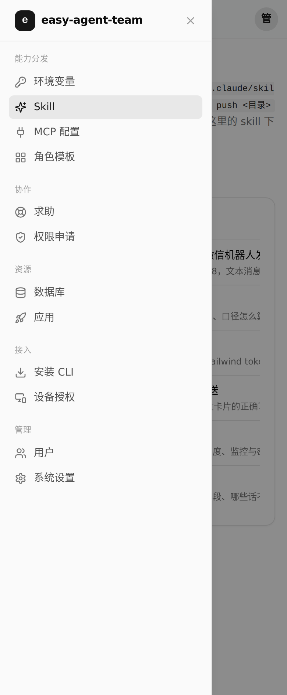
  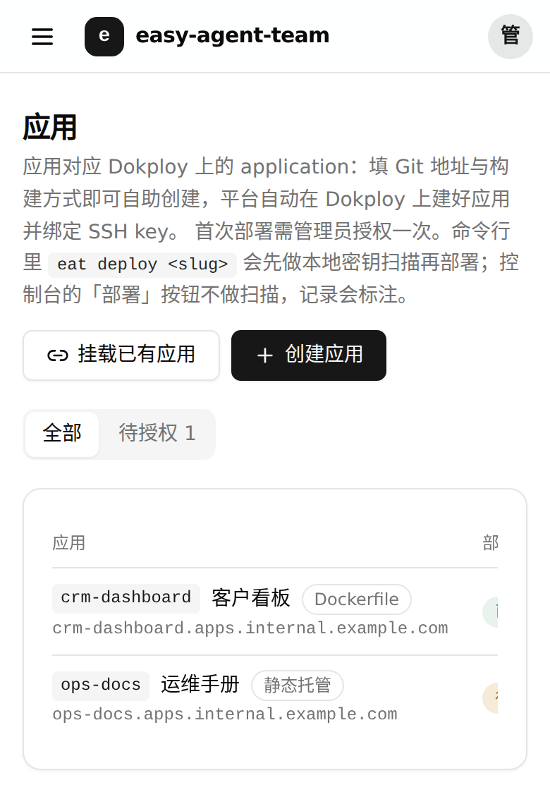
</p>

## 架构图

```mermaid
flowchart TB
    subgraph U["使用侧：团队成员与他们的本地 AI"]
        direction LR
        P["团队成员<br/>开发 / 运营 / 新人"]
        AI["本地 AI<br/>Claude Code 等"]
        CLI["eat CLI"]
        MCPS["MCP Server<br/>eat mcp"]
        WEB["Web 控制台"]
        P -->|"提出需求"| AI
        P -->|"浏览器"| WEB
        AI -->|"执行命令"| CLI
        AI -->|"stdio"| MCPS
    end

    U ==>|"HTTPS REST · Token 鉴权"| S

    subgraph S["平台服务：NestJS + Fastify 单体（一个容器）"]
        API["API 层<br/>zod 契约校验 · 资源级权限"]
        DOM["领域模块<br/>能力分发 · 人机协作 · 资源交付"]
        INF["平台基建<br/>信封加密 · 审计 · Webhook 投递 · 控制台与 CLI 托管"]
        API --> DOM --> INF
    end

    S --> PG[("PostgreSQL<br/>业务数据 + 审计")]
    S --> DOK["Dokploy<br/>部署与日志"]
    S --> TDB[("团队数据库实例")]
    S --> IM["群机器人 webhook<br/>求助通知"]
    S --> LLM["AI 网关<br/>OpenAI 接口范式"]
```

- **单体 + 单库**：REST API 与后台任务运行在同一个 NestJS 进程内，业务数据与审计写入同一个 PostgreSQL——不引入 Redis，也不部署独立 worker。控制台构建产物由后端静态托管，整体仍为单个容器。
- **三端一套契约**：请求 / 响应契约以 zod 定义在 `packages/shared`，server 据此校验，CLI 与前端复用同一份类型，三端类型一致由编译器保证。
- **AI 是一等用户**：面向人的能力均提供对应的 MCP 工具，AI 可自助调用，无需人工转述。
- **元数据公开、取值受控**：AI 默认可见配置的存在与用途说明，读取取值则需授权；无权限时返回可执行的申请引导，而非静默失败。

## 功能清单

### 用户与认证

| 能力 | 说明 |
|---|---|
| 账号与角色 | 管理员 / 成员两级平台角色 + 资源级 Owner，不引入复杂 RBAC |
| 用户管理 | 创建账号、变更角色、禁用 / 启用、重置密码；禁用与改密即时吊销该用户全部 Token |
| 开放注册 | 管理员开关 + 允许的邮箱后缀白名单，注册后即登录，无审批流程 |
| 设备码登录 | `eat login` 生成设备码 → 浏览器授权页确认，CLI 凭证写入 `~/.eat/credentials.json` |

### 环境变量

| 能力 | 说明 |
|---|---|
| 两级结构 | 环境（如 `internal-api`）+ 变量；变量元数据（key、用途备注）默认对全员可见，也可按变量单独关闭 |
| 敏感 / 非敏感 | 敏感值信封加密存储（AES-256-GCM + KEK）；非敏感值明文存储，有读取权限者在清单与控制台中直接可见 |
| 资源级授权 | 授权粒度为「用户 × 单个变量」或「用户 × 整个环境」，可设置有效期，由 Owner 与管理员管理 |
| 申请审批 | 无权限拉取时引导发起申请，由 Owner 审批；CLI / MCP / 控制台三端均可查询状态 |
| 取值下发 | `eat env pull` 按权限拉取并写入 `./.env` |
| 读取审计 | 敏感值的每次读取均记入审计日志 |

### Skill 管理与分发

| 能力 | 说明 |
|---|---|
| 纳管与版本 | `eat skill push` 上传，首次推送创建，再次推送由服务端自动递增版本 |
| 可见性与订阅 | 三档可见性（团队可见 / 授权可见 / 私有）控制可见范围；成员订阅后随同步写入本地 |
| 本地同步 | `eat sync` 将实际文件写入 `~/.agents/skills/`，并逐个软链至 `~/.claude/skills/`（Windows 下改为复制实文件） |
| 安装范围 | 默认安装至全局，也可仅安装至当前项目（`./.agents/skills/` + 相对软链）或指定的自定义目录 |
| 内置平台指南 | 为每个成员自动注入 `eat-platform-guide` Skill 并置于首位，使本地 AI 了解平台能力与正确用法 |
| 更新提示 | 服务端通过响应头下发 CLI 版本与用户级 Skill 指纹，CLI / MCP 侧提示存在新版本；`eat self-update` 一条命令完成升级 |

### MCP 配置分发

| 能力 | 说明 |
|---|---|
| 集中维护 | 管理员统一维护 MCP server 配置，成员订阅后随 `eat sync` 写入本地 |
| 密钥占位符 | 配置中使用 `${env:环境/KEY}`，下发时按该成员的权限渲染，无权限则不下发明文 |

### 角色模板

| 能力 | 说明 |
|---|---|
| 能力套餐 | 管理员预定义「一组 Skill + MCP 配置 + 环境引用」 |
| 一键套用 | 成员选定模板即批量订阅，新成员入职当天即可开始工作 |

### 求助系统（人机协作）

| 能力 | 说明 |
|---|---|
| 两类入口 | 向**指定成员**求助，或向某个 **Skill 的作者**求助（AI 依据能力描述自行选择） |
| 可求助登记 | 用户自助登记能力描述，并配置接收求助 / 接收回复两个开关 |
| 飞书通知 | 飞书群自定义机器人 webhook（支持加签，密钥由用户填入），通知为卡片消息，包含「查看请求」按钮与「发送给 Agent」代码块 |
| 多轮对话 | 求助 → 回复 → 追问 → 标记解决，CLI / MCP / 控制台三端均可读写 |
| 频率限制 | 按用户限制每小时求助次数（可配置，见 `EAT_HELP_RATE_LIMIT`） |

### 经验沉淀

| 能力 | 说明 |
|---|---|
| 经验即 Skill | 求助解决后由平台 AI 将对话整理为结构化经验，以 Skill 形式分发与订阅 |
| 自助检索 | AI 可先检索经验库，同类问题无需重复求助 |

### 数据库账号分配

| 能力 | 说明 |
|---|---|
| 实例登记 | 管理员登记团队数据库实例，管理员凭证加密存储 |
| 真实建库建号 | 成员申请 → 审批 → 平台在实例上实际创建数据库与专属账号并授权（PostgreSQL） |
| 凭证下发 | 凭证自动生成为一组环境变量，其中仅 `DB_PASSWORD` 为敏感值，整组默认仅授权给申请人 |

### 部署托管（Dokploy）

| 能力 | 说明 |
|---|---|
| 自助创建应用 | 成员填 Git 地址与构建方式即可创建应用，平台自动在 Dokploy 上建 application、绑定 Git 源与管理员预置的 SSH key；Dokploy 侧任一步失败自动回滚，不留孤儿应用 |
| 构建方式 | 仅开放两种：Dockerfile（可指定 Dockerfile 路径与构建上下文）与静态托管（发布目录 + SPA 模式；不跑构建命令，仓库里需直接有产物），创建后可改、下次部署生效 |
| 自动分配域名 | 管理员配置域名后缀后，成员新建的应用自动绑定 `<slug>.<后缀>`（可选 HTTPS），创建结果与应用详情直接给出访问地址；域名流量转发到应用声明的容器端口（静态托管固定 80） |
| 应用 env | 运行时 env 与构建时 Build Args 两块，CLI / MCP / 控制台均可拉取与推送，推送为整体覆盖、只回 key 级差异；读写记入审计 |
| 部署授权 | 成员自建的应用首次部署需管理员授权一次，之后不再拦；被拒的尝试会在控制台标为「待授权」 |
| 挂载已有应用 | 管理员可把 Dokploy 上既有的 application 挂载进平台（可从 Dokploy 搜索选择），构建配置仍在 Dokploy 侧维护，删除只解绑 |
| 成员管理 | 应用成员制，日志、env 与部署权限收敛至应用成员，操作记入审计 |
| 部署门禁 | `eat deploy` 先在本地执行密钥扫描（通用规则 + **平台密钥指纹匹配** + `.env` 误提交检查），报告随部署请求上送，未通过则不予部署；另可选配一条本地预检命令，非零退出即中止部署。控制台的「部署」按钮不做本地扫描，记录会标注「控制台」 |
| 状态透传 | 部署记录与状态一律以 Dokploy 的构建记录为准，平台库仅存储 Dokploy 不具备的业务元数据（触发人、随附的扫描报告）；构建失败时将构建日志末尾写入错误信息，在平台内即可看到真实报错 |
| 绕过可见 | 直接在 Dokploy 侧触发的部署同样列入部署历史，并标注「未经平台密钥扫描」，门禁被绕过的情况因此可见 |
| 历史留存 | Dokploy 每个应用仅保留最近 10 次构建记录，平台侧元数据只增不删，`--all` 可回溯已被清理记录的触发人与随附报告 |
| 日志读取 | 构建日志（用于排查部署失败）与容器运行日志（用于排查构建成功但服务异常），CLI 与控制台均可读取 |

> 对接的 Dokploy 版本会影响部署记录的归属准确度，另有两条 Dokploy 自身的行为限制会影响使用预期，
> 见文末的 [Dokploy 版本兼容性](#dokploy-版本兼容性)。

### 安全与审计

| 能力 | 说明 |
|---|---|
| 信封加密 | 敏感值采用 AES-256-GCM 加密，KEK 由部署环境变量提供，不依赖外部 KMS |
| 明文不外泄 | 密钥不会下发给无权限方，错误消息、日志与 webhook payload 同样不含明文（webhook 仅携带事件与链接） |
| 审计日志 | 敏感值读取、授权变更、审批决策、部署与日志读取全程留存记录 |
| 本地扫描 | CLI 端扫描可识别出与平台内密钥指纹匹配的字符串，避免密钥被提交进仓库 |

### 三端接入

上述各模块的能力，在以下入口均可使用：

| 入口 | 说明 |
|---|---|
| Web 控制台 | 管理、授权与审批的图形入口；桌面侧边栏 + 移动端抽屉布局，移动端同样可用 |
| eat CLI | 成员与本地 AI 的主通道，命令按模块分组；完整命令与参数以 `eat --help` 为准 |
| MCP Server | `eat mcp` 启动 stdio server，将平台能力封装为工具供本地 AI 自助调用；完整工具清单以 MCP 客户端中列出的为准 |
| CLI 分发 | 由平台自托管分发，不发布至 npm registry：一条命令完成安装（见下方「快速开始」），版本与平台天然一致，升级即重新安装；macOS / Linux / Windows 全链路兼容 |

## 快速开始

```bash
pnpm install && pnpm build
pnpm db:migrate && pnpm db:seed      # 初始管理员 admin@example.com / admin12345
node apps/server/dist/main.js        # http://localhost:3000
node apps/cli/dist/index.js login    # CLI 设备码登录
```

团队成员安装 CLI（由平台自托管分发，无需 npm registry；亦可打开控制台「安装 CLI」页，一键复制 Agent 安装指令交给自己的 AI）：

```bash
# macOS / Linux / WSL / Git Bash
curl -fsSL http://<平台地址>/install.sh | sh
# Windows PowerShell
powershell -ExecutionPolicy ByPass -c "irm http://<平台地址>/install.ps1 | iex"

eat login --server http://<平台地址>
```

## 环境变量配置

配置项以 [.env.example](.env.example) 为准（复制为 `.env` 后填写；`.env` 不纳入版本库，会被平台的密钥扫描拦截，`.env.example` 除外）。三个必填项：

| 变量 | 说明 |
|---|---|
| `DATABASE_URL` | PostgreSQL 连接串，生产必须指向持久化实例 |
| `EAT_KEK` | 值加密主密钥，32 字节 base64：`openssl rand -base64 32`。**丢失后密文不可恢复，务必备份**；开发环境默认使用内置的不安全值 |
| `EAT_PUBLIC_URL` | 平台对外地址，设备码授权页与 webhook 链接以此拼接 |

其余均为可选项（服务端口、初始管理员、种子开关、求助限流等），默认值与说明均见 `.env.example`。

使用方式：Docker 传入 `--env-file .env`；本地直接运行使用 `node --env-file=.env apps/server/dist/main.js`（Node 20.6+ 原生支持）。

## 部署

仓库根目录提供 `Dockerfile`（国内网络环境使用 `Dockerfile_cn`，依赖源切换为 npmmirror），详细步骤见[部署文档](docs/deployment.md)。

## 文档

- [界面截图与录屏](docs/screenshots.md) —— 控制台每个页面与 CLI 关键流程的全集；生成方式见 [`scripts/demo/`](scripts/demo/README.md)。
- [产品设计文档](docs/product-design.md) —— 产品与技术设计的唯一事实源，含权限模型、数据模型、接口设计与全部决策记录。
- [部署文档](docs/deployment.md) —— 镜像构建、Dokploy 部署步骤、备份与 CLI 自举分发。

## Dokploy 版本兼容性

平台不自建部署系统，而是挂载 Dokploy 并通过其 API 操作，因此对接的 Dokploy 版本会影响一部分行为。

### 建议 v0.25.0 及以上

平台触发部署时会将 `eat:<id>` 标记写入 Dokploy 构建记录的 `description`，读取时据此精确判定该构建记录对应
哪一次平台部署——触发人与随附的密钥扫描报告均依赖这一对应关系。而 `application.deploy` 的 `title` /
`description` 两个入参**自 v0.25.0 起才存在**：v0.24.0 及更早的版本仅接受 `applicationId`，多传的键会被静默
丢弃，既不报错，也没有任何迹象提示版本过低。

在更早的版本上平台仍可正常使用，但会自动降级为**按触发时间就近推断**归属，并在 CLI 与控制台中将该记录标注为
「⚠ 归属按时间推断」。该降级存在实际代价：同一 Dokploy 应用被并发部署时（例如几乎同时有人在 Dokploy 控制台
也触发了一次），归属可能出现错配，将未经平台密钥扫描的部署显示为已通过门禁的部署。**如需部署记录的归属可靠，
请升级至 v0.25.0 以上。**

### 两条与版本无关的 Dokploy 行为

- **每个应用仅保留最近 10 条构建记录**，超出部分连同构建日志文件一并删除，且该数值在 Dokploy 中为硬编码、
  不可配置。这是部署历史默认只有 10 条的原因；更早的部署可通过 `eat app deployments <app> --all`
  （或控制台的「显示全部历史」）从平台侧元数据回溯，可查看触发人与随附报告，但构建日志已不存在。
- **在 Dokploy 侧触发、且构建记录已被上述清理删除的部署，平台无法感知**——平台从未为其创建过元数据。
  因此「有多少次部署绕过了平台门禁」这一问题，仅在最近 10 次构建的窗口内可以准确回答。

### 已知的版本差异

| 版本 | 表现 |
|---|---|
| ≥ v0.25.0 | `application.deploy` 接受 `title` / `description` 并持久化到构建记录，部署归属精确 |
| ≤ v0.24.0 | 上述两个入参不存在、被静默丢弃，部署归属降级为按时间推断（标注 `inferred`） |
| v0.30.4（实测） | `project.all` 返回的应用条目不含 `appName` 与 `description`，控制台「从 Dokploy 选择应用」**无法按容器名搜索**，只能按应用显示名与 application id 搜索（清单本身可正常使用） |
| v0.30.5（实测） | Git 来源的应用**构建一结束就把构建记录的 `title` / `description` 覆盖成提交信息**（`init` / `Commit: <hash>`），平台写入的 `eat:<id>` 标记只在排队与构建期间存在。`eat deploy` 会立刻轮询、通常赶在覆盖前完成精确认领并把认领方式记进平台库；MCP / 控制台触发后若无人及时查看，则回落为按时间推断（标注 `inferred`）。自助创建应用、SSH key 绑定、构建方式、env 读写、部署与日志均已在该版本真机验证 |
