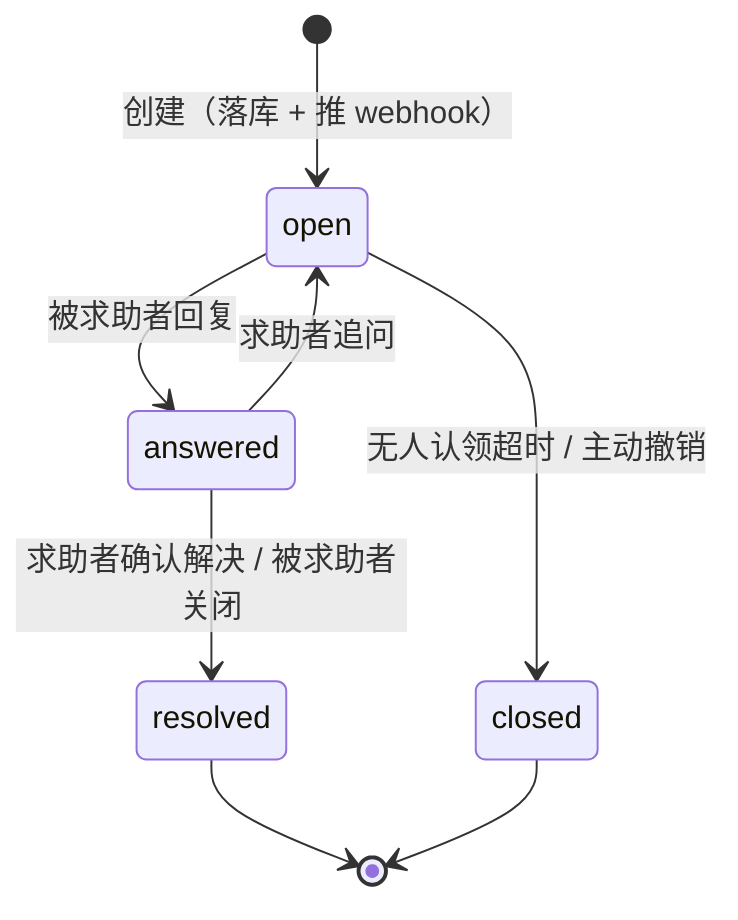
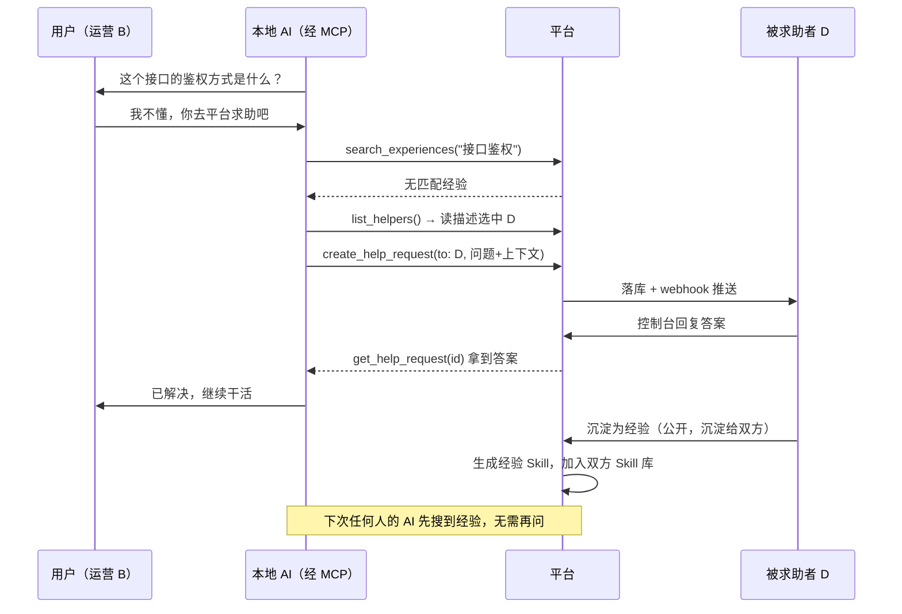
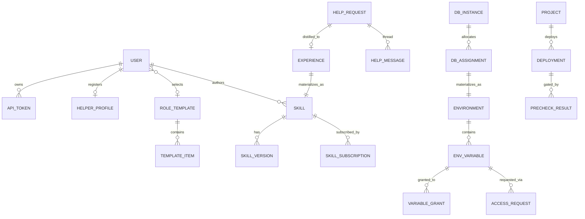
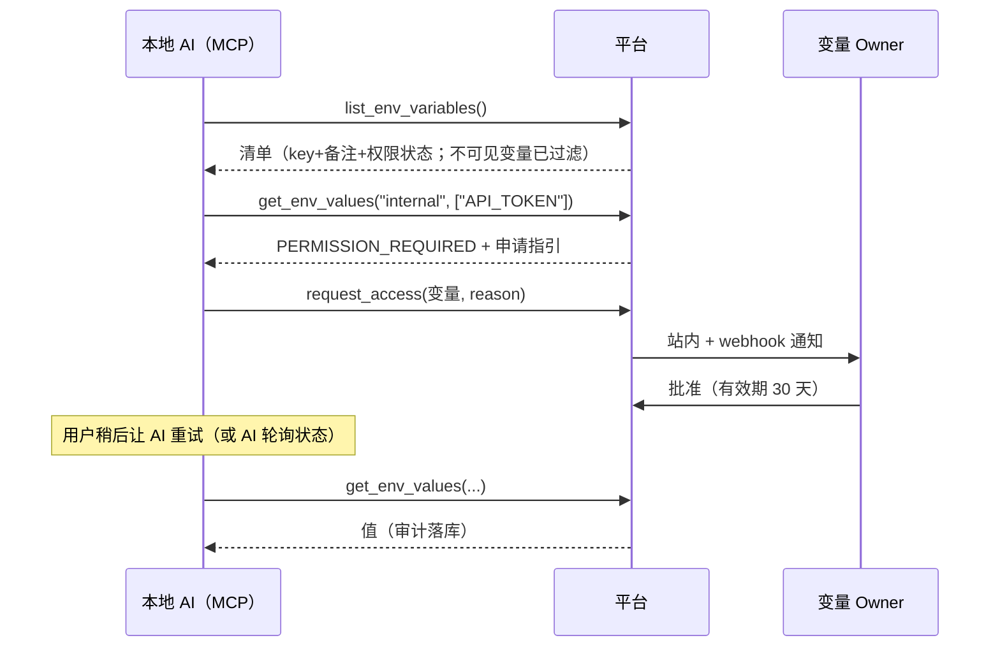

# easy-agent-team 产品设计文档

> 版本：v0.2
> 状态：核心决策已拍板（见 §10 决策记录）
> 本文基于最初的需求构思整理、补全而成，补充的设计决策在文中以「💡 设计说明」标出，可以按需推翻。

---

## 1. 产品概述

### 1.1 背景与问题

AI 编程助手（Claude Code 等）已经进入日常工作，但团队协作层面存在几个断层：

1. **能力散落**：Skill、MCP 配置、环境变量、数据库连接信息散落在每个人的本地和聊天记录里，没有统一出口。市面上的工具多面向「人人平等的协作」，缺少「**少数人开发能力 → 在权限管控下分发给其他有权限的人**」这种模式的产品。
2. **权限失控**：密钥要么完全共享（安全风险），要么完全不可见（AI 连"存在什么配置"都不知道，无从下手）。
3. **知识断层**：
   - 不懂技术的同事，听不懂 AI 提出的技术问题，卡住就只能放弃；
   - 别人的 AI 在工作中依赖**你的项目**的代码约定或领域知识，而这些知识只在你脑子里。
4. **基础设施门槛**：日常小项目也需要数据库、需要部署，但让每个成员自己申请运维资源成本太高。

### 1.2 产品定位

**面向单个团队内部使用**的 AI 能力集中管理与分发平台。

- 服务对象是团队的日常工作项目，**不是企业核心生产系统**——满足日常使用即可，不做过度设计（如数据库不搞多实例、部署不搞多集群）。
- 平台自身也通过 MCP / CLI 暴露能力，让成员本地的 AI 成为平台的一等公民用户。

### 1.3 核心理念

| 理念 | 含义 |
|---|---|
| **能力即资源** | Skill、MCP 配置、环境变量、数据库账号、部署能力，统一抽象为「可授权、可分发的资源」 |
| **元数据公开、取值受控** | 默认让 AI 能"看见清单、看懂用途"，但取值需要权限；无权限时引导走申请流程，而不是无声失败 |
| **AI 是一等用户** | 所有面向人的能力（查配置、要权限、问问题）都有对应的 MCP 工具，AI 可以自助完成 |
| **求助产生知识** | 一次求助的答案可以沉淀为 Skill 经验，让同样的问题不再问第二遍 |

### 1.4 名词约定

| 名词 | 说明 |
|---|---|
| 平台 / 控制台 | Web 管理端 |
| CLI | 命令行工具，命令名 `eat`（easy-agent-team 缩写，已定名） |
| MCP Server | 随 CLI 一起分发的 MCP 服务，本地 AI 通过它访问平台 |
| Skill | 一段可被 AI 加载的能力说明（对应 Claude Code 的 skill 目录形态） |
| 角色模板 | 管理员预定义的「能力套餐」：一组 Skill + MCP 配置 + 环境引用 |
| 求助（Help Request） | 用户或 AI 向团队内的人发起的提问 |
| 经验（Experience） | 由求助沉淀出来的可复用知识，以 Skill 形式分发 |

---

## 2. 角色与用户故事

### 2.1 平台角色

| 角色 | 权限概述 |
|---|---|
| **管理员（Admin）** | 管理用户、角色模板、数据库实例、Dokploy 接入；可管理所有资源 |
| **成员（Member）** | 使用被授权的资源；可创建自己的资源（个人 Skill、环境等）并成为其 Owner |
| **资源 Owner** | 某个具体资源的创建者/作者，对该资源有完全管理权（含授权他人、审批申请） |

💡 设计说明：团队内部产品，两级平台角色 + 资源级 Owner 已经够用，不引入复杂的 RBAC 组、部门树。资源授权直接授到「用户」粒度。

### 2.2 典型用户故事

**能力建设者（开发者 A）**
- 我开发了一套「运营周报生成」Skill，发布到平台并授权给运营组的 3 个同事，他们 `eat sync` 一下就能用。
- 我维护的项目有一堆约定，我把 Skill 配置为「允许求助」，别人的 AI 遇到我项目的问题会直接来问我，而不是瞎猜。
- 同事的 AI 需要测试库账号，我在控制台点一下分配，账号自动以环境变量形式下发给他，我不用把 root 密码发到群里。

**不懂技术的同事（运营 B）**
- 我在平台选了「运营」角色模板，本地 AI 就装好了该有的 Skill 和配置。
- AI 问我「这个接口的鉴权方式是什么」，我完全听不懂——我让 AI 自己去平台求助，它找到了这个接口所属 Skill 的作者，作者回了一句，AI 继续干活。

**普通开发成员（开发者 C）**
- 我的 AI 想调用公司内部服务，先 `eat env list` 看到有个 `INTERNAL_API_TOKEN`，备注写着用途；拉取值时提示无权限，AI 直接发起申请，Owner 批准后我重新拉取即可。
- 我写了个内部小工具，`eat deploy` 一下，平台先跑前置检查再调 Dokploy 部署，不用自己碰服务器。

**乐于助人的资深同事（D）**
- 我把自己登记进「可求助列表」，描述写「熟悉支付对账、内部 ERP 系统」，并配了飞书 webhook。别人的 AI 遇到相关问题会找到我，我手机上直接收到提醒。
- 回答完一个好问题，我把它沉淀为公开经验，以后同类问题 AI 自己翻经验库就够了。

---

## 3. 功能设计

## 3.1 用户与认证

- **账号体系**：管理员创建账号，或开启**开放注册**；单团队模式，不做多租户。控制台提供**用户管理页**（仅管理员）：建号、改角色、禁用/启用、重置密码；禁用与重置密码即时吊销该用户全部 Token；不能修改自己的角色/状态，避免锁死唯一管理员。
- **开放注册**（决策 19）：管理员在用户管理页配置——开关（默认关闭）+ 允许的邮箱后缀列表（如 `@example.com`，服务端统一规整为小写带 `@`；留空 = 任意邮箱）。开启后登录页出现注册入口（未登录可探测 `GET /api/auth/registration` 获取开关与后缀用于表单提示），注册产生 **member** 账号、邮箱统一小写落库、注册即登录；无审批流。
- **Web 登录**：账号密码（可后续接入团队现有 SSO，非 MVP）。
- **CLI / MCP 登录**：
  - `eat login` 走**设备码授权**：CLI 显示一个链接和短码，用户在浏览器登录确认，CLI 获得长期 Token；
  - Token 可在控制台查看、命名、吊销，支持有效期；
  - MCP Server 复用 CLI 的本地凭证（`~/.eat/credentials`），无需单独登录。
- **审计**：登录、Token 签发/吊销均记审计日志。

## 3.2 Skill 管理与分发

### 3.2.1 Skill 实体

每个 Skill 包含：

| 字段 | 说明 |
|---|---|
| 名称 / 标识 | 全局唯一 slug，落地为本地 skill 目录名 |
| 描述 | 供人和 AI 阅读的用途说明（即 skill 的触发描述） |
| 内容 | SKILL.md 正文 + 可选附属文件 |
| 作者（Owner） | 创建者 |
| **是否允许求助** | 开启后，该 Skill 成为求助系统的一个「求助入口」，问题会路由给作者（见 3.5） |
| 可见性 | `团队可见`（默认，人人可订阅）/ `定向授权`（仅授权用户可见可订阅）/ `私有`（仅自己） |
| 来源类型 | `手工创建` / `经验沉淀`（由求助沉淀而来，见 3.6） |
| 版本 | 每次保存产生新版本号，保留历史 |

### 3.2.2 个人 Skill 库与角色模板

用户拿到 Skill 有三条路径：

1. **自建**：在平台上创建个性化 Skill（私有或分享）。
2. **订阅**：浏览团队 Skill 市场，订阅他人分享的 Skill。
3. **角色模板**：管理员预定义角色模板（如「运营」「测试」「客服」），一个模板 = 一组 Skill + 一组 MCP 配置 + 一组环境引用。用户在个人设置里**选择自己的模板**，模板内容自动进入其同步范围。

规则：

- 用户可同时叠加「模板内容 + 个人订阅 + 自建」，冲突时按 slug 去重、个人自建优先；
- 模板由管理员维护，模板更新后成员在下次 `eat sync` 时自动获得更新；
- 用户可在模板基础上**排除**个别不想要的条目。

### 3.2.3 同步机制（CLI）

- `eat sync`：将当前用户的有效 Skill 集合落地到本地，同时生成/更新 MCP 配置。安装范围三选一（互斥，类 npx skills 的 global/project 语义）：默认/`--global` 落 `~/.agents/skills/` 并逐个软链到 `~/.claude/skills/`（跨 Agent 工具共用一份）；`--project` 落当前项目 `./.agents/skills/` 并以**相对**软链接入 `./.claude/skills/`（仓库整体提交/移动后链接仍有效）；`--dir` 自定义目录，不建软链。历史直接落在 `.claude/skills/` 的受管目录会自动迁移为软链。**Windows 上把软链换成复制实文件**（§10 决策 24），其余语义（版本判断、冲突保护、清理）完全一致；
- 采用「平台为准」的单向同步：本地被用户手工改过的沉淀目录会提示冲突，`--force` 覆盖；
- 每个落地的 skill 目录带 `.eat-meta.json` 记录来源与版本，便于增量更新与清理已退订项；
- **本地已有 skill 的纳管**：`eat skill push <目录>` 把本地写好的 skill 上传到平台——首次推送创建新 Skill（自己为 Owner），再次推送产生新版本；推送后平台成为该 Skill 的事实源，本地目录转为受管目录。

💡 设计说明：不做双向同步。个人确实要改的 Skill，引导在平台上改或改完 `push`（平台是唯一事实源），避免版本发散。

### 3.2.4 Skill 的存储与脚本策略

- **存储**：Skill 内容存 PostgreSQL——`skill_version.content` 存 SKILL.md 正文，附属文件存 `files` jsonb（`[{path, content, encoding}]`，文本直存、二进制 base64）。限制：单文件 ≤ 256KB、整包 ≤ 1MB，超限拒收。不引入对象存储 / git 后端（单体 + 单库的部署形态下，Postgres 是唯一持久层，且 skill 体量小、版本化查询需求强）。
- **脚本**：skill 目录里的辅助脚本（`scripts/*.sh`、`*.py` 等）作为普通附属文件存储分发，**服务端永远不执行**。执行发生在使用者本地（`eat sync` 落地到 `~/.agents/skills/<slug>/`（软链/复制到 `~/.claude/skills/`）并恢复可执行位，可执行位在 Windows 上无意义），以使用者本人的权限运行——信任级别等同于安装团队内部 npm 包。
- **安全防线**：① Owner + 版本历史 + 审计保证出处可追溯；② `eat skill push` 上传时服务端做密钥扫描（复用部署前置检查规则），防止密钥被硬编码进脚本分发；③ 附属文件路径校验，禁止 `../` 与绝对路径，落地只能写入 skill 自身目录；④ `eat sync` 对包含可执行脚本的 skill 在首次安装/变更时明确提示。管理员预审开关留作 P2 可选。

### 3.2.5 MCP 配置分发

平台同时管理「团队可用的 MCP Server 配置」：

- 管理员或成员登记 MCP 配置（名称、传输方式、URL/命令、说明、所需环境变量引用）；
- 授权模型与 Skill 一致；配置中的敏感字段（token）以**环境变量引用**方式声明，实际取值走环境变量的权限体系（见 3.3），实现一份权限模型管到底；
- `eat sync` 时按用户权限渲染出 `.mcp.json` 片段。

## 3.3 环境变量管理

### 3.3.1 结构

```
环境（Environment）
 ├── 备注（供人和 AI 理解这个环境是干嘛的）
 └── 变量（Variable）×N
      ├── Key / Value（敏感变量加密存储；非敏感变量明文存储）
      ├── 是否敏感（默认：敏感；见下）
      ├── 备注（这个变量的作用，AI 会读）
      ├── 授权名单（哪些用户可读取值——敏感与否都适用）
      └── 无权限时是否可见（默认：可见）
```

- 环境示例：`公司内部服务`、`测试数据库`、`第三方 SaaS`；
- 环境有 Owner（创建者），Owner 和 Admin 可管理环境（编辑名称/备注、删除）与变量、授权；
- **非敏感变量**（§10 决策 23）：服务地址、端口这类配置可标记为非敏感——**只改变存储与展示、不改变授权模型**：值明文存储（`value_plain`），**有读取权限者**在清单里直接看到明文值（控制台明文展示可复制、CLI/MCP 清单含 `value`），无需再走「拉取」；无权限者与敏感变量一样只见 key+备注、取值需申请授权。非敏感值读取不落审计、不进密钥指纹清单。敏感性可在更新时切换。

### 3.3.2 可见性与取值的分离（核心设计）

这是本模块的核心：**「知道存在」和「拿到值」是两级权限**。

| 状态 | 清单中可见（key + 备注） | 可读取值 |
|---|---|---|
| 已授权 | ✅ | ✅ |
| 未授权 + 变量配置为「无权限可见」（默认） | ✅（明确标注"无权限"） | ❌，返回结构化错误并引导申请 |
| 未授权 + 变量配置为「无权限不可见」 | ❌ | ❌ |

效果：本地 AI 想找一个配置时，先 `list` 拉清单——它能**看懂每个变量的作用**（靠备注），确认目标后再取值；若无权限，系统返回：

```json
{
  "error": "PERMISSION_REQUIRED",
  "variable": "internal-services/INTERNAL_API_TOKEN",
  "message": "你没有读取该变量值的权限",
  "how_to_request": "调用 request_access 工具发起权限申请，Owner 批准后重试"
}
```

### 3.3.3 权限申请与审批

原始构思里提到「提醒它没有权限，需要申请权限」，这里补全整个闭环：

1. 用户或 AI 对一个或多个变量发起**权限申请**（附申请理由）；
2. 申请通知资源 Owner（站内 + Owner 配置的 webhook）；
3. Owner 在控制台一键批准/驳回，批准时可设**授权有效期**（永久 / 7 天 / 30 天…）；
4. 申请者（及其 AI）可查询申请状态，批准后重新拉取即可；
5. 全程记审计日志。

### 3.3.4 安全要求

- 敏感变量值加密存储（信封加密：主密钥 KEK 来自部署环境变量，数据密钥 AES-256-GCM）；非敏感变量明文存储、读取不落审计——但授权要求与敏感变量一致（§10 决策 23）；
- 控制台默认打码显示，点击查看/复制记审计；
- **每一次敏感值的读取（含 CLI/MCP 拉取）都记审计日志**：谁、何时、拉了什么；
- 支持值轮换：更新值后旧值不可再拉取，审计可追溯变更历史。

## 3.4 数据库账号分配管理

定位：满足团队成员**日常工作项目**用库需求，不服务生产级核心项目，因此：

- **不做多实例编排**：管理员登记若干共享数据库实例（如一台 MySQL、一台 PostgreSQL），够用即可；
- 隔离粒度为「实例内的库 + 账号」：为每个申请创建独立 database/schema 和专属账号，权限限定在自己的库内。

流程：

1. 管理员登记实例（类型、连接地址、管理凭证——凭证同样加密存储）；
2. 成员发起「数据库申请」（选实例、填项目名和用途）或由管理员直接分配；
3. 平台在实例上自动执行：建库 + 建账号 + 授权（也支持纯手工登记模式，兼容不能自动执行的场景）；
4. **分配结果自动生成为一个环境（或环境变量组）**：`DB_HOST / DB_PORT / DB_NAME / DB_USER / DB_PASSWORD`，整组默认仅授权给申请人——其中**仅 `DB_PASSWORD` 为敏感**（加密存储、读取落审计），主机/端口/库名/账号为非敏感明文存储、有权限者平台明文可见（§10 决策 23）；数据库账号的下发、拉取、审计**完全复用环境变量体系**；
5. **共用给其他成员 = 普通的环境授权**：该环境对全员可见 key+备注（AI 经 `eat env list`/MCP 清单可发现），Owner 可整环境授权他人（可设有效期），其他成员也可走申请审批自助获取；项目 skill 里可写明"连接信息从环境 xxx 拉取"作为引导，但凭证永远不进 skill 内容，只走环境变量通道；
6. 支持回收：禁用账号（可恢复）；删除分配为**仅记录级软删除**（§10 决策 13）——删除平台记录与凭证环境，实例上的库与账号**不做物理删除**，控制台二次确认时明确提示「只能到数据库实例上手动删除」；已删除（status=deleted）的分配**不再出现在任何列表**，记录仅留库内供审计（§10 决策 23）。

💡 设计说明：「分配结果 = 一组环境变量」是关键复用点：不为数据库账号单独造一套拉取/授权/审计通道。

## 3.5 求助系统（人机协作核心）

### 3.5.1 要解决的两个场景

1. **同事不懂技术**：AI 向用户提出技术问题，用户听不懂 → 用户让 AI 去平台求助真人；
2. **跨项目知识依赖**：A 的 AI 干活时依赖 B 的项目的代码约定/领域知识 → AI 直接向 B（该项目 Skill 的作者）求助。

发起方可以是 **AI 自主发起**（干活中遇阻），也可以是**用户主动让 AI 发起**。

### 3.5.2 求助对象（两类入口）

**① Skill 作者**
- 每个 Skill 可配置「是否允许求助」（默认关闭）；
- 开启后，使用该 Skill 的 AI 遇到相关问题，可直接对着这个 Skill 发起求助，路由给作者。

**② 可求助者列表（Helper Registry）**
- 每个用户可**把自己登记**进可求助列表，登记内容：
  - **能力描述**：一段自然语言，描述自己擅长的领域——**这段描述会被 AI 读取，用于选择向谁求助**；可留空；
  - **飞书机器人 Webhook 配置**（可选，控制台里默认折叠、展开编辑）：Webhook 地址 + 「加签」密钥（机器人开启签名校验时从飞书粘贴，加密存储、不回显）+ 两个独立开关——**接收求助**（找我的新求助推送到群）与**接收回复**（我参与的求助有新回复时推送到群），默认均开启（§10 决策 16/17）；
  - 接单状态：`可接单` / `勿扰`（临时下线，不出现在 AI 的候选名单里）。

AI 发起求助时可以：指定 skill、指定具体 helper，或者传 `auto` 由 AI 先 `list_helpers` 读描述后自选。

### 3.5.3 求助请求的生命周期



- 每个请求有**请求 ID** + 标题 + 问题描述 + 可选上下文（代码片段、报错信息——由 AI 组织，注意提示不要携带密钥）；
- 支持**多轮对话**：请求下是一串消息，双方都可追加；
- 创建与每次回复都会：落库 + 推送对方的 webhook + 站内通知；
- **可见性：默认仅求助者、被求助者与管理员可见**（管理员可见用于日常管理与合规审查；对其他普通成员不可见）；
- AI 侧通过 `get_help_request(id)` 读取最新回复；CLI 也可 `eat ask show <id>`；
- **删除**：求助者本人或管理员可删除求助（连带对话记录，不可恢复），控制台 / `eat ask delete` / MCP `delete_help_request` 均可操作；**已沉淀为经验的求助不可删除**（经验库引用该求助）。

### 3.5.4 防骚扰

- AI 发起求助有频率限制（如每用户每小时 N 条），超限提示先自行尝试；
- 求助创建前强制要求填写「已经尝试过什么」，减少伸手党问题；
- helper 可将请求一键转给更合适的人（重新指派）。

## 3.6 经验沉淀

一次有价值的求助不应只解决一次问题。

### 3.6.1 沉淀规则

- 一个 `resolved` 的求助可以被**沉淀为经验（Experience）**；
- 沉淀时可配置（**默认：不公开、沉淀给求助者、不沉淀给自己**——helper 已掌握该知识，通常无需再进本地 sync）：
  - **是否公开**：公开 → 进入团队经验库，人人可见可订阅；不公开 → **仅求助双方可见**；
  - **沉淀给谁**：`沉淀给求助者` / `沉淀给被求助者` / 两者（多选）；
- **编辑权限：仅被求助者（回答者）可修改经验内容，求助者无权修改**——保证知识出自懂的人之手；
- 沉淀操作本身由被求助者执行（求助者可发起"申请沉淀"提醒对方）。

### 3.6.2 沉淀形式：经验即 Skill

- 沉淀时，平台调用配置的 AI 模型（见 3.9）把 Q&A 自动整理成 Skill 草稿：描述 = 问题的适用场景，正文 = 结论与操作要点，并保留对原求助的引用；被求助者确认或修改草稿后发布；AI 不可用时回退为手工模板编辑；
- 沉淀产出的 SKILL.md 由平台统一在正文前合成标准 frontmatter（`name` = slug、`description` = 经验描述），保证落地本地后可被 AI 会话按 description 发现触发；手工提供且自带 frontmatter 的内容不重复合成；
- 该 Skill 的来源类型为 `经验沉淀`，Owner 为被求助者；
- 沉淀目标用户（求助者/被求助者）的个人 Skill 库自动加入该 Skill，下次 `eat sync` 落地本地；
- **引用式而非拷贝式**：被求助者后续修改经验，所有订阅方 sync 后自动拿到最新版；
- 公开经验可被全团队检索（控制台 + MCP `search_experiences`），AI 遇到问题时**应先搜经验库再发起求助**（写进平台自带的基础 Skill 里）。

### 3.6.3 求助 → 沉淀完整流程



## 3.7 部署托管（Dokploy 集成）

定位：让成员（及其 AI）能自助部署日常小项目，**平台不自建部署系统，挂载 Dokploy、通过其 API 操作**。

### 3.7.1 功能

- 管理员登记 Dokploy 实例（API 地址 + Token，加密存储）；
- 平台内建「项目（Project）」实体：绑定 Git 仓库 + Dokploy 上的 application，配置项目成员（谁可部署）；
- 部署操作：触发部署、查看部署状态与日志、回滚（映射 Dokploy API 能力）；
- **部署记录与状态一律以 Dokploy 为准（决策 30）**：平台库只存 Dokploy 没有的业务元数据（谁触发的、带了什么检查报告），靠触发时写进 Dokploy 构建记录 `description` 的 `eat:<id>` 标记精确认领；**在 Dokploy 侧直接触发的部署也会被列出来并标注「未经平台密钥扫描」**，绕过门禁这件事因此变得可见；Dokploy 每个应用只保留最近 10 条构建记录，更早的历史用 `--all` 从平台元数据看；
- CLI/MCP：`eat deploy` / `trigger_deploy` 触发；`eat project status` / `get_deploy_status` 看结果（失败时 error 里已带构建日志末尾的真实报错）；`eat project build-logs` / `get_build_logs` 看构建日志，`eat project run-logs` / `get_run_logs` 看容器运行日志——AI 据此自查失败原因，不必跳去 Dokploy 控制台（决策 28）。

### 3.7.2 代码前置检查（Pre-deploy Checks）

部署前的强制闸门，检查通过才调用 Dokploy API：

**执行位置（已拍板，决策 #8）：检查在 CLI 发起端本地执行，平台不拉代码、不跑构建、不依赖 Docker runner。** 部署者本地本来就有代码与构建环境，检查零基础设施成本。

- **密钥泄漏扫描（CLI 本地，`eat deploy` 内置强制执行）**，三层：
  1. 通用模式：私钥块、AWS Key、平台 Token 形态、JWT 等经典特征（与 `eat skill push` 共享规则库）；
  2. **平台密钥指纹匹配**（独有能力）：CLI 从平台拉取密钥指纹清单——所有环境变量值的 SHA-256 单向指纹（仅对长度/熵足够的值生成，防离线字典猜测；清单读取落审计），对工作区文件的候选 token 同法比对——命中即证明真实下发的密钥被硬编码进了代码；
  3. 误提交检测：仓库中不允许出现含值的 `.env` 文件；
- **构建检查外包给 Dokploy**：Dokploy 部署本身即构建（Dockerfile/Nixpacks），构建失败=部署失败，平台轮询状态并把构建日志透传给 AI；`eat deploy --check "<命令>"` 提供可选的本地预跑；
- **防绕过**：部署 API 要求请求携带 CLI 检查报告（结论 + 规则版本），缺省拒绝——团队内部信任模型下，把"绕过"从顺手变成显式行为即可；
- 检查报告落 `precheck_result`，部署记录关联；**失败报告面向 AI 可读**——AI 拿到原因自行修复后重试部署；
- **不做**：平台侧 runner（拉代码+容器构建）——将来出现强管控需求再评估；CI 回调模式降为可选扩展；依赖漏洞审计、大文件、Dockerfile 规范检查有真实需求再加。

## 3.8 CLI 与 MCP 能力总览

CLI 与 MCP Server 同一个产物分发（平台自托管下载：类 Unix `curl -fsSL <平台>/install.sh | sh`，Windows `irm <平台>/install.ps1 | iex`，见 §7.5），MCP Server 由 `eat mcp` 启动（Windows 的 MCP 客户端要写成 `cmd /c eat mcp`，§10 决策 24）。

### CLI 命令

| 命令 | 功能 |
|---|---|
| `eat login` / `eat logout` / `eat whoami` | 设备码登录、登出、查看当前身份 |
| `eat sync [--global\|--project\|--dir <dir>]` | 同步 Skill + MCP 配置到本地（模板 + 订阅 + 自建 + 沉淀经验）；默认全局，`--project` 装到当前项目 |
| `eat skill push <dir>` | 把本地已有 skill 上传纳管（首次创建、再次推送出新版本） |
| `eat env list [env]` | 列出可见环境与变量清单（key + 备注 + 权限状态） |
| `eat env pull <env> [--format dotenv]` | 拉取有权限的变量值，写入 `.env` 或输出 |
| `eat env request <env>/<KEY> --reason "..."` | 发起权限申请 |
| `eat ask create / show / list / reply / delete` | 发起求助、查看回复、追问、删除（仅求助者/管理员）；按 ID 操作的子命令都接受 8 位短 ID 前缀（决策 25） |
| `eat deploy [project]` | 触发部署（前置检查内置）；触发成功即进入 Dokploy 队列，随后轮询到构建结果 |
| `eat project list / status / deployments` | 项目清单、最近一次部署状态（`--deployment <id>` 查指定那次，Dokploy 构建 id 与平台元数据 id 都认、支持 8 位前缀）、部署历史（`--all` 看平台完整历史，决策 30） |
| `eat project build-logs / run-logs <project>` | 构建日志 / 容器运行日志（`--tail`、`--list`、`--deployment`/`--container`）（决策 28） |
| `eat self-update` | 把 CLI 更新到平台当前分发的版本（重拉 `/install/eat.js` 覆盖本地产物，跨平台同一条命令）（决策 26） |
| `eat db list` | 查看自己名下的数据库账号（引导用 env pull 取凭证） |

### MCP 工具

| 工具 | 说明 |
|---|---|
| `list_env_variables` | 变量清单（含备注与权限状态），供 AI 认路 |
| `get_env_values` | 取值；无权限返回结构化 `PERMISSION_REQUIRED` |
| `request_access` | 发起权限申请 |
| `get_access_request_status` | 查询申请状态 |
| `search_experiences` | 搜索经验库（求助前先搜） |
| `list_helpers` | 列出可求助者及其能力描述（含允许求助的 Skill 作者） |
| `create_help_request` | 发起求助（指定 skill / helper / auto） |
| `get_help_request` / `reply_help_request` / `delete_help_request` | 读取回复、追问、删除误发起的求助 |
| `trigger_deploy` / `get_deploy_status` | 触发部署 / 查最近一次（或指定那次）的状态与失败原因；必须带 `project`，`history` + `all` 可列完整历史（决策 30） |
| `get_build_logs` / `get_run_logs` | 构建日志 / 容器运行日志（决策 28） |

💡 设计说明：平台内置一个「平台使用指南」基础 Skill（`eat-platform-guide`，§10 决策 11），教 AI 正确的行为序列（先搜经验 → 再求助；先 list → 再 pull → 无权限则申请），这比在每个工具描述里堆规则更有效。实现为**内置虚拟 Skill**：内容随平台代码维护（`packages/shared/src/platform-guide.ts`，改内容须递增版本号），`sync-bundle` 对所有登录用户始终注入首位（`relation=builtin`），不落数据库、不可退订，slug 为保留名不可被 push 占用；登录后首次 `eat sync` 即落地，之后随平台升级自动更新。安装到登录之间的窗口由免鉴权的 `/install/AGENT.md` 兜底。

## 3.9 平台 AI 接入

平台自身引入 AI 来完成「经验沉淀整理」等需要模型能力的功能：

- **配置方式**：管理员在系统设置中配置 `api_base_url` / `api_key` / `model` 三个参数，**采用 OpenAI 接口范式**（Chat Completions 兼容），可对接任意兼容网关或代理；
- **当前用途**：经验沉淀的 Q&A → Skill 草稿整理（P1）；
- **可扩展用途**（后续按需开启）：求助路由建议（根据 helper 描述推荐求助对象）、变量/环境备注的润色生成、公开经验的检索摘要；
- **安全与观测**：`api_key` 加密存储；每次调用记录用途、模型、token 用量，便于观测成本；
- **数据边界**：沉淀整理会把求助正文发送给所配置的模型服务——控制台在配置处明示这一点，接入的服务由团队自行选择信任；
- **降级**：AI 配置缺失或调用失败时，相关功能回退为手工模式，不阻塞主流程。

## 3.10 通知与 Webhook

- 平台级出站 webhook：求助创建/回复、权限申请/审批结果、部署完成/失败；
- 用户级 webhook：helper 登记时配置的告警地址（3.5.2）、个人通知偏好；
- 出口为**飞书群自定义机器人**格式（§10 决策 16/17）：求助/回复为 `msg_type=interactive` 卡片消息——含请求 ID、标题、描述/回复摘要（截断）、「查看请求」按钮（跳详情页）与「发送给 Agent」代码块（自定义机器人卡片按钮不支持复制到剪贴板，代码块自带复制按钮，整段复制发给 Agent 即可让它通过 MCP/CLI 接手），不携带任何密钥值；机器人开启「加签」时按飞书规范附 `timestamp` + `sign`（HmacSHA256(key=`${timestamp}\n${secret}`, data=空) 后 base64），签名密钥由用户从飞书粘贴、平台加密存储；按响应体 `code` 判定成败（飞书失败常为 HTTP 200 + 非零 code）。卡片构建逻辑在 `packages/shared`，`scripts/test-feishu-card.mjs` 可传入 webhook 实测卡片效果。其他 IM/通用端点待有需求再扩展；
- 失败重试（指数退避，最多 5 次），控制台可查推送记录。

---

## 4. 权限模型汇总

| 资源 | 无权限者可见性 | 授权方式 | 审批人 |
|---|---|---|---|
| Skill（团队可见） | 元数据+内容可见 | 订阅即用 | — |
| Skill（定向授权） | 不可见 | Owner 授权 | Owner |
| 环境变量 | 默认 key+备注可见（可关）；值不可见 | Owner 授权 / 申请审批，可带有效期 | Owner / Admin |
| 数据库账号 | 仅本人 | 申请或管理员分配 | Admin |
| 求助请求 | 仅求助双方 + 管理员 | — | — |
| 经验（非公开） | 仅求助双方 + 管理员 | 沉淀时指定 | 被求助者 |
| 经验（公开） | 全员 | 订阅即用 | — |
| 部署项目 | 项目成员 | Owner 添加成员 | 项目 Owner |
| 角色模板 | 全员可选用 | 管理员维护 | Admin |

不变式（实现时需保证）：

1. 变量**值**永远不出现在无权限的响应里（包括报错信息、日志、审计详情对第三方的展示）；
2. 经验的编辑入口只对被求助者开放；求助者对沉淀内容只读；
3. 求助正文与非公开经验仅对求助双方和管理员可见，对其他普通成员不可见；
4. 所有敏感读取（取值、查看密钥、拉取数据库凭证）必须落审计。

---

## 5. 领域模型与数据设计

### 5.1 领域模型总览



### 5.2 核心表（字段级摘要）

**user**：id, name, email, role(admin|member), password_hash, status, created_at

**api_token**：id, user_id, name, token_hash, expires_at, last_used_at, revoked_at

**skill**：id, slug, name, description, owner_id, visibility(team|granted|private), allow_help(bool), source(manual|experience), current_version_id, created_at

**skill_version**：id, skill_id, version, content(SKILL.md 正文), files(jsonb), changelog, created_at

**skill_subscription**：user_id, skill_id, source(template|manual|experience), excluded(bool)

**role_template**：id, name, description, created_by —— **template_item**：template_id, item_type(skill|mcp_config|environment), item_id

**mcp_config**：id, slug, name, description, transport, config(jsonb, 敏感字段写作 `${env:ENV/KEY}` 引用), owner_id, visibility

**environment**：id, slug, name, description, owner_id, source(manual|db_assignment)

**env_variable**：id, environment_id, key, value_encrypted, description, visible_without_permission(bool, 默认 true), version, updated_at

**variable_grant**：id, variable_id, user_id, granted_by, expires_at, created_at
（支持环境级批量授权：grant 亦可挂 environment_id 表示整环境授权）

**access_request**：id, requester_id, target_type(variable|environment|db), target_ids, reason, status(pending|approved|rejected), decided_by, decided_at, grant_expires_at

**db_instance**：id, name, engine(mysql|postgres), host, port, admin_credentials_encrypted, note
**db_assignment**：id, instance_id, user_id, db_name, db_user, purpose, environment_id(生成的环境), status(active|disabled|deleted), created_at

**helper_profile**：user_id, description(AI 会读取，可空), webhook_url, webhook_secret, notify_help(bool), notify_reply(bool), available(bool)

**help_request**：id, requester_id, helper_id, skill_id(nullable，经 skill 入口发起时), title, description, context, tried(已尝试内容), status(open|answered|resolved|closed), created_at
**help_message**：id, request_id, sender_id, content, created_at

**experience**：id, help_request_id, skill_id(沉淀生成的 skill), public(bool), granted_to_requester(bool), granted_to_helper(bool), created_by(=helper), updated_at

**project**：id, name, repo_url, dokploy_app_id, owner_id —— **project_member**：project_id, user_id
**deployment**：id, project_id, triggered_by, status(pending|checking|deploying|success|failed), dokploy_ref, created_at
**precheck_result**：id, deployment_id, check_type(secret_scan|build|custom), status, report, created_at

**ai_setting**：id, api_base_url, api_key_encrypted, model, enabled（单行系统配置，OpenAI 接口范式）
**ai_call_log**：id, purpose(experience_distill|...), model, prompt_tokens, completion_tokens, status, created_at

**audit_log**：id, actor_id, actor_token_id, action, target_type, target_id, meta(jsonb), ip, created_at

**webhook_delivery**：id, event_type, target_url, payload_digest, status, attempts, last_attempt_at

---

## 6. 关键流程

### 6.1 AI 获取环境变量（含无权限申请）



### 6.2 部署流程

`eat deploy` → CLI 在发起端本地执行前置检查（密钥扫描含平台指纹匹配 + 可选 `--check` 预跑，平台不拉代码，见决策 #8）→ 全部通过后携带检查报告调用平台 API → 平台校验报告并创建 deployment → 调 Dokploy API 触发部署 → 轮询状态回传 → 成功/失败通知触发人。任一本地检查失败则终止，AI 可读检查报告自行修复后重试。

---

## 7. 技术架构建议

### 7.1 总体架构

```
┌─────────────┐   ┌──────────────┐   ┌────────────────┐
│  Web 控制台  │   │  CLI (eat)   │   │ 本地 AI + MCP   │
└──────┬──────┘   └──────┬───────┘   └──────┬─────────┘
       │        HTTPS / REST API（Token 鉴权）│
┌──────┴──────────────────┴──────────────────┴─────────┐
│                    平台服务（单体）                     │
│  认证/授权 · Skill · 环境变量 · 求助 · 经验 · 部署编排   │
│  审计 · Webhook 分发 · 前置检查 Runner 调度             │
└──────┬───────────────┬───────────────┬───────────────┘
   PostgreSQL      检查 Runner       外部系统
  （业务+审计）   （隔离容器跑检查）   Dokploy API / 团队 DB 实例 / IM webhook
```

### 7.2 选型建议

| 层 | 选择 | 理由 |
|---|---|---|
| 平台服务 | **NestJS（Fastify 适配器）单体**：REST API + 后台任务一体 | 领域模块多、后台工作重（webhook 重试/部署轮询/检查调度），模块化 + DI + Guard 承载资源级权限最顺手；一个容器丢进 Dokploy |
| 控制台前端 | React + Vite + **Tailwind CSS v4 + shadcn 风格组件**（SPA），构建产物由后端静态托管 | 内部管理后台无 SEO 需求；组件源码内置仓库（Radix 原语 + cva + react-hook-form），样式完全可控、包体积小；桌面侧边栏 + 移动端抽屉的响应式布局；多板块页面（求助/数据库/权限申请）用页内 tabs 组织并同步 URL `?tab=`（决策 22）；部署仍是一个容器（初版用 Ant Design，决策 21 迁移） |
| 任务队列 / 定时 | pg-boss（队列落 PostgreSQL）+ `@nestjs/schedule` | 重试与轮询不为此引入 Redis，基础设施保持「一个容器 + 一个库」 |
| 数据库 | PostgreSQL | jsonb 灵活、单库承载业务+审计+队列足够 |
| ORM | Drizzle（首选）/ Prisma | SQL 可控、迁移即 SQL、无引擎二进制 |
| CLI + MCP | TypeScript 单包；tsup(esbuild) 打包为单文件 JS，npm 分发；MCP 用官方 `@modelcontextprotocol/sdk`（stdio）；详见 7.5 | 与前后端同栈；`eat mcp` 即起 server |
| 平台 AI 调用 | OpenAI 接口范式（Chat Completions 兼容），`api_base_url / api_key / model` 可配 | 可对接任意兼容网关，不绑定供应商 |
| 加密 | 信封加密，KEK 走部署环境变量，AES-256-GCM | 无需引入外部 KMS |
| 检查 Runner | 平台内起 Docker 容器执行（同机） | 日常项目规模够用 |
| 部署 | 平台自身用 Docker 部署在 Dokploy 上 | 自举，吃自己的狗粮 |

### 7.3 为什么是 NestJS 而不是 Next.js 全栈

早先候选里有 Next.js 全栈，最终定为 NestJS 单体，理由：

1. **平台的重心不在页面**：主要消费者是 CLI 和 MCP（非浏览器客户端），控制台只是内部管理后台——Next.js 的核心优势（SSR/RSC/SEO）在这里全用不上；
2. **大量请求之外的后台工作**：webhook 失败重试、部署状态轮询、前置检查容器调度、授权过期清理、AI 调用。Next.js 的 API Route 是请求驱动的，要做这些得另起 worker 进程，「单体最省事」的初衷反而被破坏；NestJS 配 pg-boss / `@nestjs/schedule` 是常规路径，单进程搞定；
3. **领域模块多**：skill / env / grant / help / experience / deploy / audit，NestJS 的模块化与依赖注入适合 domain-heavy 单体；Token 鉴权与资源级权限检查用 Guard/装饰器承载，横切逻辑不散落。

### 7.4 Monorepo 结构

```
easy-agent-team/
├── apps/
│   ├── server/    # NestJS：REST API + 后台任务 + 静态托管控制台
│   ├── web/       # React + Vite + Tailwind CSS + shadcn 风格组件控制台
│   └── cli/       # eat CLI + MCP server（tsup 打包，npm 分发）
├── packages/
│   └── shared/    # zod 契约与 API 类型 + typed client（三端共用）
└── pnpm-workspace.yaml
```

- 请求/响应契约用 zod 定义在 `shared`：服务端用 nestjs-zod 校验，CLI 与前端用同一份类型生成 typed client——三端类型一致由编译器保证；
- 单容器镜像：构建时把 web 产物拷进 server 镜像，NestJS ServeStatic 托管。

### 7.5 CLI 构建与分发

- **语言与运行时目标**：TypeScript，产物兼容 Node ≥ 18；不使用 Bun/Deno 独有 API。团队成员使用 Claude Code 时本机已有 Node，零额外门槛；
- **打包**：tsup（底层 esbuild）打包为单文件 JS + shebang，依赖全部内联；
- **分发（§10 决策 9、24、29）**：**不发 npm registry，平台自托管**——平台镜像内置 CLI 单文件产物，提供五个免鉴权端点：`GET /install.sh`（POSIX 安装脚本：校验 Node ≥ 18，下载产物到 `~/.eat/bin` 并生成 `eat` 启动器，随后按 §10 决策 15 三层叠加配置 PATH）、`GET /install.ps1`（Windows PowerShell 安装脚本，与 sh 版一一对应，§10 决策 24；只生成 `eat.cmd` + `eat` 两个 shim，**不落 `eat.ps1`**，§10 决策 29）、`GET /install/eat.js`（单文件产物本体）、`GET /install/AGENT.md`（给 AI Agent 的安装指令，**只含 CLI 流程，不提及 MCP**，§10 决策 20；含两套平台命令并要求 Agent 先判断系统）、`GET /install/MCP.md`（MCP 配置指引独立板块，仅无 shell 环境的 AI 客户端需要）。成员一条命令完成安装（类 Unix `curl -fsSL <平台>/install.sh | sh`，Windows `powershell -ExecutionPolicy ByPass -c "irm <平台>/install.ps1 | iex"`），版本天然与平台一致，升级 = 重装；
- **安装页（§10 决策 10）**：控制台 `/install` 页面向所有成员提供「给 Agent 的一键复制指令」（主推路径，只装 CLI）与手动分步说明（按平台分 macOS/Linux 与 Windows 两个页签，按 UA 嗅探默认选中，§10 决策 24）；「MCP 配置」为页面上的独立板块（决策 20），仅面向无 shell 环境的 AI 客户端；
- **开发期**：可以用 Bun 跑测试与本地开发提速，但 CI 产物始终按 Node 目标构建，避免运行时行为差异；
- **不选型**：bun 单二进制（目标用户全部有 Node，多平台产物让镜像膨胀数百 MB，收益为零）；Go/Rust 重写会造成与平台的技术栈分裂（CLI 与后端共享 API 类型定义的收益丢失）——这同时决定了 Windows 上只能靠 shim 而非原生 exe 作为入口，见 §10 决策 29；Deno 生态与 npm 包（MCP SDK）仍有摩擦。

---

## 8. 安全设计要点

1. **密钥永不下发明文到无权限方**：包括错误消息、日志、webhook payload（webhook 只带事件与链接，不带值）；
2. **传输**：全程 HTTPS；CLI Token 仅存本地用户目录（0600）；
3. **存储**：变量值、数据库管理凭证、Dokploy Token、webhook secret、平台 AI 的 api_key 全部加密落库；
4. **审计**：敏感读取/授权变更/部署操作全量审计，控制台可按资源、按人检索；
5. **提示注入面**：求助内容、helper 描述、经验正文都会被 AI 读取——控制台展示时提示"此内容会被 AI 读取"，MCP 返回中以数据段包裹并注明来源，不作为指令执行（写进平台基础 Skill 的安全准则）；
6. **防泄漏闭环**：部署前置检查内置密钥扫描，扫描规则联动平台内登记的变量值指纹（对值做不可逆指纹匹配，不存明文规则）。

---

## 9. MVP 与路线图

### P0 —— 最小可用（价值闭环：集中管理 + 权限分发）

- 用户/登录/Token、设备码授权
- 环境变量管理：环境/变量 CRUD、备注、授权、无权限可见性开关、申请审批闭环
- Skill 管理：创建、版本、团队可见/私有、订阅、本地纳管（`eat skill push`）
- CLI + MCP：login / sync / skill push / env list / env pull / request_access
- 审计日志（敏感读取）

### P1 —— 人机协作（求助与经验）

- Helper 登记（描述 + webhook + 勿扰）
- Skill「允许求助」入口
- 求助全流程（创建/多轮/状态机/可见性）+ webhook 推送
- **平台 AI 接入**（OpenAI 接口范式：api_base_url / api_key / model，加密存储 + 调用观测）
- 经验沉淀（公开性、沉淀对象、helper 独占编辑、经验即 Skill 分发、AI 自动整理草稿 + 手工回退）
- MCP：search_experiences / list_helpers / create_help_request / get_help_request

### P2 —— 能力扩展

- 角色模板（管理员定义、成员选用、模板同步）
- MCP 配置分发（含环境变量引用渲染）
- 数据库账号分配（实例登记、自动建库建号、以环境变量形式下发、回收）

### P3 —— 部署托管

- Dokploy 接入、项目/成员、部署触发与日志（构建检查由 Dokploy 构建承担）
- CLI 端前置检查（密钥扫描 + 平台指纹匹配 + .env 误提交），部署 API 携带报告
- MCP 部署三件套

---

## 10. 决策记录

以下问题已拍板（#1–12 于 2026-08-27，#13 于 2026-08-28），正文已按结论更新：

| # | 问题 | 结论 |
|---|---|---|
| 1 | 管理员对求助内容的可见性 | **可见**。求助正文与非公开经验对求助双方 + 管理员可见，对其他成员不可见（§3.5.3、§4） |
| 2 | CLI / 平台命名 | 就叫 **`eat`**（§1.4） |
| 3 | 求助的响应时效 | MVP 暂不考虑超时转派/升级，靠 webhook 提醒 + 人肉催 |
| 4 | 经验沉淀的 AI 自动整理 | **引入**。平台以 OpenAI 接口范式接入 AI（api_base_url / api_key / model 可配），用于经验沉淀等功能，随 P1 交付（§3.9） |
| 5 | 本地已有 skill 的纳管 | **支持**。`eat skill push` 上传纳管，随 P0 交付（§3.2.3） |
| 6 | 平台开发框架 | **NestJS（Fastify）单体 + React/Vite/AntD SPA + pnpm monorepo**，队列用 pg-boss，ORM 首选 Drizzle（§7.2–7.4） |
| 7 | 存储 | **全量 PostgreSQL，不引入对象存储**。Skill 附属文件限单文件 256KB / 整包 1MB，超限拒收并引导外部引用（§3.2.4）；将来出现真实大文件需求再评估 OSS |
| 8 | 部署前置检查的执行位置 | **CLI 发起端本地执行**（密钥扫描含平台指纹匹配），构建检查外包给 Dokploy 构建，部署 API 要求携带检查报告防顺手绕过；平台侧 runner（拉代码+Docker 构建）不做（§3.7.2） |
| 9 | CLI 分发渠道 | **不发 npm registry，平台自托管下载**：镜像内置 CLI 单文件，`curl <平台>/install.sh \| sh` 安装；产物保持 tsup 单文件 JS（Node ≥ 18），bun 单二进制不做（目标用户都有 Node）（§7.5） |
| 10 | 成员上手方式 | 控制台提供**安装页**（人机双视角）：给人看的分步说明 + 给 AI Agent 的一键复制安装指令（同一份文案也在 `GET /install/AGENT.md` 公开提供，`packages/shared` 单一来源）（§3.1） |
| 11 | 平台使用指南 Skill 的携带方式 | **内置虚拟 Skill**（方案 A）：内容随平台代码维护、版本号常量控制更新，`sync-bundle` 对所有用户始终注入，不落库、不可退订、slug 保留；获取需登录（`eat sync`），登录前由免鉴权 `/install/AGENT.md` 兜底（§3.8） |
| 12 | `eat sync` 落地目录 | 实际文件落 `~/.agents/skills/`（跨 Agent 工具共用），逐个**软链**到 `~/.claude/skills/`；历史直接落地目录自动迁移；`--dir` 自定义时不建软链（§3.2.2） |
| 13 | 数据库分配的删除语义 | **仅记录级软删除，平台不做物理 DROP**：删除只标记记录 deleted 并移除凭证环境，实例上的数据库与账号保留，物理清理由管理员在实例上手动执行；控制台二次确认时明确提示。rejected 的记录同样可删（§3.4） |
| 14 | `eat sync` 安装范围参数 | 类 npx skills 的 global/project 语义：默认/`--global` 落 `~/.agents/skills/` + 软链 `~/.claude/skills/`（决策 12 布局不变）；`--project` 落当前项目 `./.agents/skills/` + **相对**软链 `./.claude/skills/`；`--dir` 仍为自定义目录不建软链；三者互斥（§3.2.3） |
| 15 | 安装脚本 PATH 落地 | **三层叠加（非递进兜底），全部幂等**：① 软链 `~/.local/bin/eat`（XDG 惯例，无需 sudo）；② `/usr/local/bin` 可写时软链（系统级 PATH，非交互 shell 可见）；③ 幂等写 shell 配置——zsh 写 `~/.zshenv`（非交互也加载，而非 `.zshrc`），bash 写 `~/.bashrc`，登录 shell 写 `~/.bash_profile`（仅存在 `~/.profile` 且无 `~/.bash_profile` 时改写 `~/.profile`，避免屏蔽），marker 注释去重。三层互为冗余覆盖不同 shell 场景，保证 Agent 的非交互子进程也能直接调 `eat`（§7.5） |
| 16 | 求助 webhook 通知形态 | **只支持飞书群自定义机器人**（替换最初的「通用 JSON + 平台生成 HMAC 密钥」设计）：「加签」密钥由**用户从飞书粘贴**（可选、加密存储、不回显，留空更新表示保持不变，清空地址一并清除），平台不再生成/展示自己的签名密钥；按响应体 code 判定投递成败。钉钉/企微/通用端点待有需求再扩展（§3.10）。消息格式后升级为卡片（决策 17） |
| 17 | 求助通知卡片化与通知开关 | 求助/回复通知从 `msg_type=text` 升级为**飞书卡片消息**：含请求 ID、标题、描述/回复摘要（截断）、「查看请求」按钮与「发送给 Agent」代码块（自定义机器人卡片按钮不支持复制到剪贴板，用代码块替代，客户端自带复制）；helper 登记增加**接收求助 / 接收回复**两个独立开关（默认开启），**能力描述可留空**；控制台 webhook 配置区默认折叠。卡片构建在 `packages/shared`（server 与 `scripts/test-feishu-card.mjs` 测试脚本共用）（§3.5.2、§3.10） |
| 18 | 求助删除与沉淀默认对象 | ① 求助支持删除（控制台 / `eat ask delete` / MCP `delete_help_request`）：仅**求助者本人或管理员**，连带对话记录硬删除；**已沉淀为经验的求助不可删**（经验库引用）。② 沉淀弹窗「沉淀给我自己」**默认不勾选**（API 契约 `grantedToHelper` 默认 false）——helper 已掌握该知识，无需再进本地 sync（§3.5.3、§3.6.1） |
| 19 | 开放注册 | 管理员可开启**自助注册**（默认关闭），并可限制**允许的邮箱后缀**（多个；留空 = 任意邮箱；服务端规整为小写带 `@` 前缀）。开启后登录页出现注册入口；注册产生 member 账号、邮箱统一小写、**注册即登录**；无审批流（要审批的团队保持关闭、走管理员建号）。设置存单行 `registration_setting` 表，`GET /api/auth/registration` 对未登录公开开关与后缀（§3.1） |
| 20 | Agent 安装流程与 MCP 定位 | **给 Agent 的安装流程只装 CLI**（安装 → 登录 → sync → 验证），不再提及 MCP——有终端环境的 Agent 用 CLI 即覆盖全部能力。**MCP 是无 shell 环境 AI 客户端的接入方式**，配置方法拆为独立板块：安装页独立卡片 + 免鉴权 `GET /install/MCP.md`（前提为 CLI 已装已登录，MCP 复用 CLI 凭证）。平台指南 Skill 同步改为 CLI 优先表述（§3.8、§7.5） |
| 21 | 控制台 UI 迁移 shadcn + Tailwind | 控制台从 Ant Design 全量重构为 **Tailwind CSS v4 + shadcn 风格组件**（Radix 原语 + cva 源码内置 `apps/web/src/components/ui/`，不走 shadcn CLI；表单栈 react-hook-form，消息 sonner，图标 lucide，搜索选择 cmdk；移除 antd/dayjs，日期改原生 `datetime-local`）。布局重设计：桌面**左侧分组侧边栏**（能力分发/协作/资源/接入/管理）+ 顶栏用户菜单，移动端汉堡 + 抽屉导航；**手机端自适应**——表格次要列按断点隐藏并折叠进主列、横向滚动兜底、弹窗与表单全宽适配。全部 16 页面经 Playwright 桌面/移动双视口截图与交互冒烟（登录、校验、弹窗建删、抽屉导航）验证（§7.2） |
| 22 | 多板块页面改 tabs 布局 | 一个页面上下平铺多个功能板块的布局不合理，改为**页内 tabs**（新增 `components/ui/tabs.tsx`，Radix Tabs）：求助页「找我的求助 / 我发起的求助」、数据库页「我的数据库（默认）/ 数据库实例 / 全部分配（仅管理员）」、权限申请页「待我审批 / 我发起的申请」。tab 触发器带**待处理数角标**（待我回复的求助 / 有新回复 / 待批准 / 待审批）；当前 tab 同步到 URL `?tab=`（`useTabParam`，默认 tab 不写 URL、replace 不污染历史），刷新与深链可用。低频配置不再平铺、收进页头按钮弹窗（按钮带状态圆点）：求助页「我的可求助登记」（接单状态圆点）、用户页「注册设置」（开放注册圆点）。设置页（两块配置表单纵排）保持原布局——settings 型页面平铺表单是常规形态（§7.2） |
| 23 | 非敏感环境变量（明文存储） | 变量新增 **`secret` 标记（默认敏感）**，**只影响存储与展示、不改变授权模型**——读值（含 CLI/MCP 拉取）无论敏感与否都需授权（Owner/管理员/被授权者）。敏感值加密存储（`value_encrypted`）、控制台打码、每次读取落 `secret.read` 审计；**非敏感值明文存储**（`value_plain` 列）、**有读取权限者在平台直接明文可见**——清单（`GET variables` / catalog / MCP `list_env_variables`）对有权限者直接附带明文 `value`，控制台表格明文展示并可复制；无权限者与敏感变量一致（可见 key+备注、值需申请）。非敏感值读取不落审计、**不进密钥指纹清单**（值本身不是密钥）。数据库分配生成的凭证环境同步遵循：**仅 `DB_PASSWORD` 敏感**，`DB_HOST/DB_PORT/DB_NAME/DB_USER` 为非敏感明文存储，整组默认仍仅授权申请人（§3.3、§3.7）。同批补齐控制台缺失的管理入口：环境详情页**编辑（名称/备注）/ 删除环境**，部署项目弹窗**编辑配置 / 删除项目**（接口原已具备）；数据库分配**删除后（status=deleted）不再出现在任何列表**，记录仅留库内供审计 |
| 24 | Windows 兼容 | **安装入口按平台成对提供、CLI 内部按平台切换落地方式**（业界通行做法）：① 新增 `GET /install.ps1`（PowerShell 5.1+），与 `install.sh` 一一对应——下载 `eat.js` 后生成 shim（`eat.cmd` + `eat`，**不含 `eat.ps1`**，见决策 29），对齐 npm cmd-shim 的做法（Windows 建软链需管理员或开发者模式，不可依赖）；PATH 写**用户级环境变量**（`[Environment]::SetEnvironmentVariable(...,'User')`），**不用 `setx`**（超 1024 字符会截断）。② 两个脚本都把逻辑包进函数、末行才调用（`main "$@"` / `Install-EatCli`），管道下载被截断时不会执行半截脚本。③ `eat sync` 在 Windows 上把 `.claude/skills` 的**软链换成复制实文件**（junction 只支持绝对目标，`--project` 的相对链接用不了；skill 是 KB 级文本且 sync 是唯一写入方），受管副本按 `version + syncedAt` 判断是否重写，遗留软链自动迁移为副本。④ AGENT.md 给出两套命令并要求 Agent 先判断平台；安装页按 UA 嗅探分页签；MCP 指引补 Windows 形式 `cmd /c eat mcp` 与 `node <绝对路径>\eat.js mcp` 兜底（Node 出于安全不允许不经 shell 直接拉起 `.cmd`）。⑤ 凭证文件 0600 在 Windows 上被忽略，依赖 `%USERPROFILE%` 默认 ACL，不额外调 icacls（§7.5、§3.2.2） |
| 25 | 资源 ID 的呈现与查询 | **单条记录的输出给完整 ID，查询接受短 ID 前缀**：触发部署（`eat deploy`）与 `eat deploy-status` 的输出改为完整 UUID，调用方拿到即可直接用于后续查询；列表命令（`deploy-list` / `ask list`）仍展示前 8 位以保证可读性。服务端统一用 `resolveShortId`（`apps/server/src/common/short-id.ts`）把前缀还原成完整 ID：① **最小 8 位**，更短直接 400，避免过短前缀命中一大片；② **前缀匹配范围 = 调用者的可见范围**而非「能列出来的范围」——求助按「双方 + 管理员」过滤（管理员因此可用短 ID 操作第三方求助，此前 CLI 端匹配 mine+inbox 会失效），同时前缀不能成为探测他人记录是否存在的手段；③ 命中多条回 409 `AMBIGUOUS_ID`，**只提示改用完整 ID，不返回候选清单**（触发入口给的本就是完整 ID）；④ 非法字符/无匹配一律 404——此前短 ID 会让 PG 的 uuid 语法错误冒泡成 500。配套：CLI 顶层错误打印补上服务端的 `details`（此前被丢弃，`VALIDATION_FAILED` 只剩一句「请求参数不合法」）；`eat deploy` 扫描到 0 个文件时告警，避免 `--dir` 指错目录导致密钥门禁静默放行（§3.8、§6.2） |
| 26 | CLI / Skill 更新检测与提示 | **检测走响应头搭车，提示面向 Agent 设计，按版本去重**：① 服务端对自报身份的请求（`x-eat-client`）在响应头带 `x-eat-cli-version`（平台分发的 CLI 版本，唯一事实源 `packages/shared/src/version.ts` 的 `CLI_VERSION`）与 `x-eat-skill-version`（该用户 Skill 集合的指纹）——CLI 的联网命令本就要请求平台，**零额外往返、无需检查节流**；控制台不带该头，不为它多查一次库。② **Skill 指纹 = sorted(`slug@version`) 的 FNV-1a 64 位哈希**：平台没有全局 Skill 版本号，且「该同步哪些」是 per-user 的（订阅 + 角色模板 − 排除 + 内置指南），只有集合指纹能同时覆盖三类变化（已有 Skill 出新版本 / 新增订阅 / 退订删除）；只做等值判定，故用纯 JS 哈希（shared 被浏览器端引用，不能引 node:crypto）。服务端算它只查 `skills` 表的 slug + currentVersion，不 join 版本内容，另加 60 秒 per-user 内存缓存。③ **提示只走 stderr，stdout 永远保持干净可解析**，且**不做 TTY 判断**——Agent 调用时本就不是 TTY，照搬 gh/npm 的「非 TTY 即静默」等于对目标用户永不提示。④ **按版本去重**（`~/.eat/state.json` 记 `notifiedCliVersion` / `notifiedSkillVersion`），一个任务里连跑十几条命令只提示一次，避免污染 Agent 上下文；文案显式声明「不影响本次命令结果」，防止 Agent 中断手上的活或误以为命令失败。⑤ **只提示不自动更新**，任何环节失败静默吞掉，绝不改变命令输出与退出码。⑥ 新增 **`eat self-update`**（重拉 `/install/eat.js` 覆盖本地产物，先写同目录临时文件再覆盖、校验 shebang 与体量防写坏）——跨平台同一条命令，Agent 不必先判断操作系统再选 install.sh / install.ps1；另加免鉴权 `GET /install/version.json` 给未登录场景。⑦ **MCP 侧改挂在工具返回的独立内容块**（stdio server 的 stderr 只进客户端日志，Agent 看不见），首块仍是合法 JSON。⑧ 关闭开关 `EAT_NO_UPDATE_NOTIFIER=1`（兼容 `NO_UPDATE_NOTIFIER` 惯例）。基线由 `eat sync` 写入；无基线的老客户端从 `~/.agents/skills/*/.eat-meta.json` 反推指纹，目录不存在（从没同步过）即按空集合处理并提示 sync（§3.8、§7.5）
| 27 | 建项目时从 Dokploy 选应用 | **application id 仍可手写，另给可搜索的快速填写**：新增 `GET /api/dokploy/applications`，服务端调 Dokploy 的 `project.all`（**一次就带回各项目及其 applications，不必按项目逐个再查**；响应里的 postgres/compose 等其他服务不取）展平成 `{ applicationId, name, appName, projectName, description }`。**应用挂在哪一层随 Dokploy 版本而变**：老版本直接挂在 `project.applications`，引入「环境」之后挂在 `project.environments[].applications`——两种都认（2026-09-01 真机实测的新版本只有后者，只认老形状会让清单恒为空、前端表现为「没有匹配的应用」）；非默认环境的应用在分组名上带出环境名 `项目 · 环境`，同名应用才分得清是哪套环境。**防御式解析**：缺 `applicationId` 的条目跳过、`name` 缺失回落到 id、响应不是数组回空清单——一个异常条目不该毁掉整张清单。**权限与创建项目一致（任何登录成员，不加 `@Roles('admin')`）**：成员本就能手填任意 application id 建项目并部署，清单只是把已开放的能力变得可发现，且只含应用名与 id、不含任何凭证。控制台在建项目/改项目弹窗的 ID 输入框旁加「从 Dokploy 选择」（Popover + cmdk，按 Dokploy 项目分组），**搜索同时匹配应用名、容器名 `appName` 与 id**——同名应用在不同 Dokploy 项目下很常见，只按显示名搜会选错；选中后写回输入框并在 hint 显示「已选择：<应用名>（<项目名>）」，手动改 id 后该提示自动消失。只在弹开时才请求 Dokploy（`enabled: open` + 60 秒 staleTime），不为每次打开项目弹窗都打一次外部服务。**Dokploy 未配置/停用回 503 `DOKPLOY_UNAVAILABLE`，选择器就地显示原因并提示「仍可在上方手动填写」**，不阻断建项目。**2026-09-02 用云端会话内自建的 Dokploy v0.30.4 真机复验（`scripts/dev-dokploy.sh`）**：`project.all` 里每个 application 只有 `applicationId` / `name` / `applicationStatus` 三个字段，**不含 `appName` 与 `description`**（`application.one` 才有，那里字段有 119 个）；防御式回落把两者置空，清单、分组、选中回填都正常，但**「按容器名 `appName` 搜」在该版本上等于失效**，只剩按应用名与 id 搜。补齐要对每个应用再打一次 `application.one`——为一个次要检索维度换 N 次外部请求不划算，**暂不补**；`appName` 字段与两种挂载形状的兼容逻辑保留，老版本仍吃得到（§3.8）
| 28 | 构建日志 / 运行日志与 CLI 命令结构 | **部署失败的原因要在平台里就能看到，不该让人去开 Dokploy 控制台**。原先 `deploy-status` 失败时只有一句「详见 Dokploy 控制台该应用的部署日志」，且状态取自 `application.one` 的 `applicationStatus`——那是**应用当前状态**，同一应用被别人再次部署就会串味。改动：① **状态改以 Dokploy 的构建记录为准**（`deployment.allByType?id=<appId>&type=application`，一次部署一条）；Dokploy 的部署是排队执行的，触发那一刻记录还没建出来，故**懒绑定**——首次查状态时取「我们触发之后建出来的第一条」（留 5 秒时钟差余量）记进 `deployment.dokploy_deployment_id`；绑不上先维持 `deploying`，**超过 10 分钟**才回落到 `applicationStatus`，免得记录永远卡住。② **失败时把构建日志末尾 12 行直接写进 `error`**（读 100 行、截断 800 字符），`eat deploy` / `eat project status` / MCP `get_deploy_status` 当场就能看到 `npm ERR!`、`Pulling image failed` 这类真实报错。③ 新增 `GET /api/projects/:slug/build-logs`（Dokploy `deployment.readLogs`，纯 REST）与 `GET /api/projects/:slug/run-logs`。**运行日志只有 WebSocket 一条路**：v0.30.4 上把 tRPC router 全枚举 + 端点实探（`docker.getContainerLogs` 等一律 404）+ 编译产物里 `docker logs` 命令的三处出处，都指向同一结论，REST 侧无对应过程；但**平台侧不做实时流**——带 `tail=N` 连上去，收完这一批就断开（静默 800ms / 硬超时 15s / 2MB 上限，服务端跑的是 `--follow` 永远不会主动结束），对外仍是打完即退的一次性读取。为此 `apps/server` 引入 `ws`（曾手写过最小只读实现，权衡后改用成熟实现，协议边界不自己扛）。日志**可能带出构建期注入的密钥，权限收紧到项目成员/Owner/管理员**（比部署历史严），读取落审计 `deploy.build_logs_read` / `deploy.run_logs_read`。④ **CLI 命令结构整理**：`projects` / `deploy-status` / `deploy-list` 三个平铺命令收进 `eat project` 名词组（`list` / `status` / `deployments` / `build-logs` / `run-logs`），与既有的 `env` / `skill` / `ask` / `db` 一致；**`eat deploy` 保持顶层**——最高频，且做成 `project deploy` 后 `eat project status` 会与「`project <slug>`」形式产生解析歧义。名词用 **project 而非 application**：平台实体自始至终叫项目（`/api/projects`、控制台「项目」页、`list_projects`），application 是 Dokploy 那边的词。`status` 改为吃**项目 slug**（`--deployment` 查指定那次），不必先记住 UUID。旧命令保留为**隐藏别名**并在 stderr 提示新写法——平台指南、AGENT.md、Agent 记忆里都还留着旧写法。⑤ MCP 补 `get_build_logs` / `get_run_logs`（此前 §3.7.1 与内置指南一直宣称有 `get_deploy_logs`，**实际从未实现**，Agent 调了就报错），`get_deploy_status` 改为可直接传 `project` 看最近一次（§3.7、§3.8） |
| 29 | Windows 上不生成 `eat.ps1` | **PowerShell 入口靠 `eat.cmd` 兜住，安装脚本刻意不落 `.ps1` shim**。决策 24 按 npm cmd-shim 的惯例生成了三件套，实测在 Windows 上直接把 PowerShell 用户堵死：① PowerShell 解析命令时 `.ps1` 的优先级**高于** `PATHEXT` 里的 `.cmd`，② Windows PowerShell 5.1 默认 `ExecutionPolicy = Restricted` 拒绝执行任何 `.ps1` 文件——两条叠加的结果是 `eat` 报「无法加载文件 …\eat.ps1，因为在此系统上禁止运行脚本」，也就是 npm 那个最著名的 Windows 报错，而本来完全可用的 `eat.cmd` 被 `.ps1` 挡在后面永远选不中。（安装命令 `irm … | iex` 不受影响：执行策略只管**脚本文件**，管不了管道里的字符串，这也是各家一键安装都写成这个形式的原因。）业界只有两种解法：**发原生 exe、根本不落 `.ps1`**（Claude Code 自身的 Windows 安装、gh、uv、deno、rustup 都是这一档，exe 不受执行策略约束），或者**照 npm 落 `.ps1` 然后让用户自己去改 `Set-ExecutionPolicy`**（npm/pnpm/yarn 及所有 npm 分发的 Agent CLI 都在这一档）。eat 是 Node 单文件分发、不打算出 exe，因此取「不落 `.ps1`」这一半：**只生成 `eat.cmd`（cmd / PowerShell / `shell:true` 子进程通用）与 `eat`（Git Bash）**，PowerShell 自然回落到 `eat.cmd`，用户零操作、也不必被诱导去降低自己机器的安全设置（企业 GPO 场景本来也改不动）。代价只有 `.cmd` 的 `%*` 转发对含 `&` `^` `%` 的参数不如 `.ps1` 保真，属可接受；**退出码没有损失**：批处理把 node 的 errorlevel 作为自身退出码返回，PowerShell 的 `$LASTEXITCODE` 仍拿到真值，部署门禁等按退出码判定的命令不受影响。同时补两处文案：AGENT.md 明确要求 Agent **不要自己造 `eat.ps1`**、并给出 `cmd /c eat …` 与 `node "%USERPROFILE%\.eat\bin\eat.js" …` 两种兜底调用；安装脚本与 AGENT.md 都说明**用户级 PATH 只对新进程生效**——AI 客户端若在安装前就已启动，它拉起的终端继承的仍是旧 PATH，这不是安装失败，重启客户端即可（§7.5） |
| 30 | 部署记录以 Dokploy 为准，平台只存业务元数据 | **部署记录与状态的唯一事实源是 Dokploy，平台库只存 Dokploy 没有的业务信息**。决策 28 已经把状态改成「以构建记录为准」，但仍在 `deployment` 表里维护一份 `status`/`error` 影子状态，于是要靠懒绑定 + 按需刷新 + 10 分钟超时回落去对齐它——列表接口还没做刷新，一条 `deploying` 能永远卡住；更关键的是**在 Dokploy 侧直接触发的部署平台完全看不见**，决策 #8 的密钥扫描门禁因此形同自愿、且不可观测。改动：① **`deployment` 表删掉 `status` / `error` / `updated_at`**，只留 `project_id` / `triggered_by` / `report` / `dokploy_deployment_id`（加唯一索引）；**行只增不删**，因为 Dokploy 会清理构建记录而「谁在什么时候带着什么扫描报告部署了生产」是平台的合规记录。② **认领靠标记而非猜时间**：`application.deploy` 接受可选的 `title` / `description` 并原样持久化到构建记录上（对 Dokploy 源码逐 tag 核对：`apiDeployApplication` 的 zod schema、仓库自带 `openapi.json` 的 requestBody、router 的 `titleLog`/`descriptionLog`、`deployApplication → createDeployment` 四处；**v0.25.0 起支持**，v0.24.0 及更早的 deploy 只吃 `applicationId`，老版本 zod 静默丢弃未知键、不报错，天然降级）。平台把 `eat:<元数据 id>` 写进 `description`（`title` 写人话，Dokploy 控制台的部署列表会显示它），读取时精确认领。**顺序是先触发成功、再落库**——Dokploy 拒绝时不留下永远认领不到的孤儿元数据；也因此触发失败直接回 503，不再伪造一条 `failed` 记录。③ **认领三轮**：标记精确匹配 → 已回写的 `dokploy_deployment_id` → 按触发时间就近推断（只用于**没有标记**的构建记录，覆盖老版本 Dokploy 与本次改造前的历史行，结果标成 `claim=inferred` 让 CLI/控制台显示「归属是猜的」）。两条铁律是冒烟实测踩出来的：**已认领过的元数据不再参与时间推断**（否则 Dokploy 清理掉它的构建记录后，它会转头认领别人在 Dokploy 侧点的部署，把未经扫描的部署冒充成平台部署），**也不再因「刚触发不久」退回 queued**（那是 archived）。④ **Dokploy 每个应用只保留最近 10 条构建记录**（`createDeployment` 每次都调 `removeLastTenDeployments`，连日志文件一起删，硬编码不可配）——所以默认视图就是「Dokploy 上还留着的那些」，`?all=1` / `--all` 改以平台元数据为主干做并集，被清理的显示为 `archived`；`deployments/latest` 在「Dokploy 已清空但平台有历史」时给专门文案，不说「还没部署过」误导人再部署一次。⑤ **排队中的部署读 `deployment.queueList`**（组织级全量，自己按 `applicationId` 过滤；只认 waiting/delayed 等未开始状态，active 说明构建记录多半已建出来；任务带 `removeOnComplete/removeOnFail`，跑完即消失）；该端点拿不到时（老版本、临时故障）用「刚触发 10 分钟内且从未认领过」兜底，保证 `eat deploy` 完立刻查得到自己那次。⑥ **状态取值直接用 Dokploy 的** `running`/`done`/`error`/`cancelled`，外加平台补的 `queued`/`archived`；**顺带修一个 bug**：此前契约把枚举写成 `running|done|error|idle`，`idle` 是 `applicationStatus` 的取值、不是构建记录的，导致**被取消的构建在平台上显示成「空闲」**。⑦ **失败详情收紧权限**：构建日志末尾那 12 行只补给项目成员，非成员只看到 Dokploy 记录上的 `errorMessage`——此前 `error` 里的日志摘录对任何登录用户可见，与决策 28 把日志收紧到成员的判断相矛盾。⑧ **破坏性 API 变更**：`GET /api/deployments/:id` 删除（Dokploy 的构建 id 反查不出属于哪个项目），改项目内 `GET /api/projects/:slug/deployments/:id`，Dokploy 构建 id 与平台元数据 id 都认、都支持 8 位前缀；CLI 升 0.4.0，`eat project deployments` 加 `--all`，隐藏别名 `eat deploy-status <id>` 停用并打印新写法。**已知缺口**：「在 Dokploy 侧触发 + 构建记录已被清理」的部署平台永远看不到（元数据从来就不存在），要长期统计门禁绕过率得另起一个定期抓取 Dokploy 记录落库的任务，本次不做。**验证方式**：这个会话的出站策略 403 挡住了 Docker Hub 的 blob CDN（`production.cloudfront.docker.com`），Dokploy 真机起不来，故改为**对 Dokploy 官方源码按 tag 精确核对**（v0.24.0 / v0.25.0 / v0.28.x / v0.30.4 / v0.30.5）+ **用桩模拟真实时序做全链路冒烟**（CLI 的 deploy/deployments/--all/status、MCP `get_deploy_status`、控制台桌面与移动双视口），上面两条铁律正是冒烟时暴露出来的（§3.7、§3.8） |
