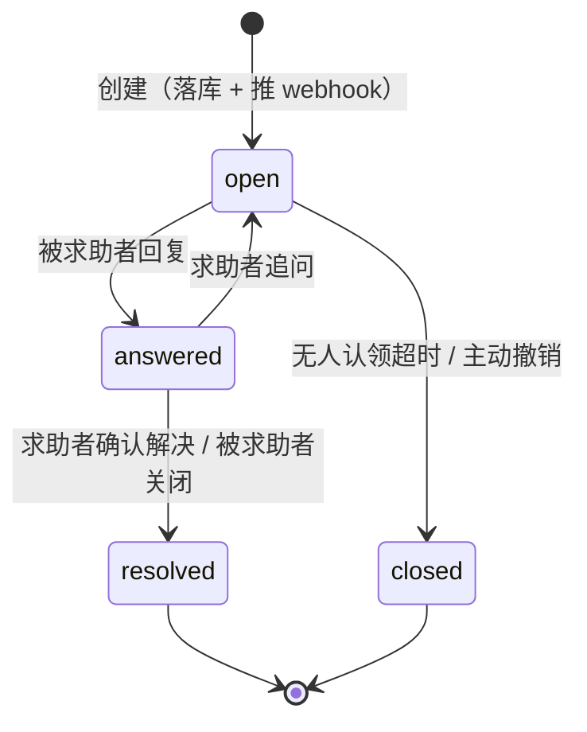
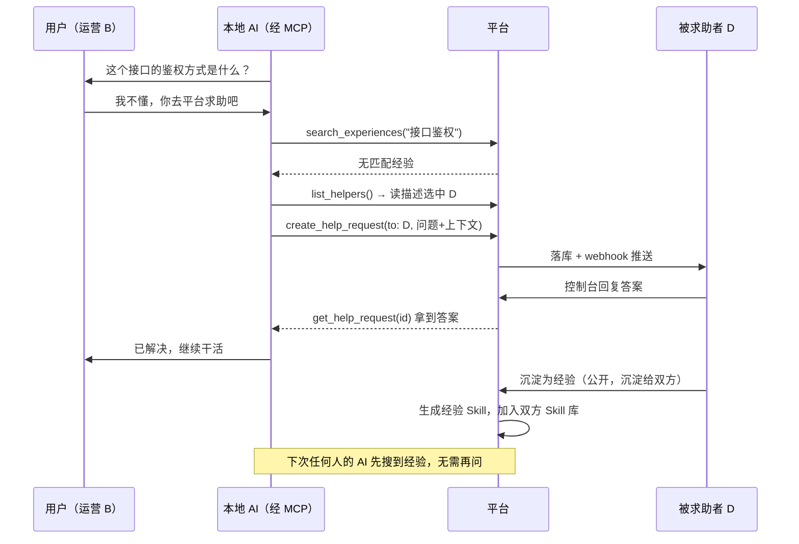
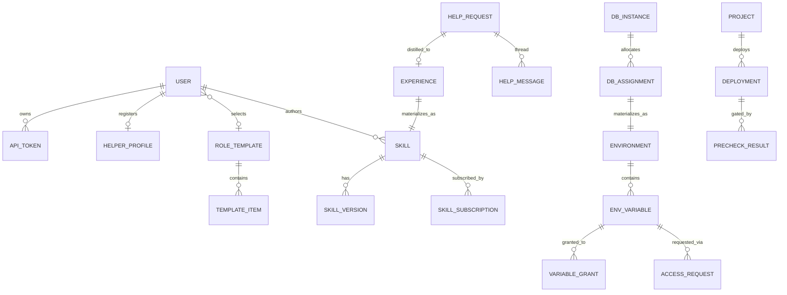
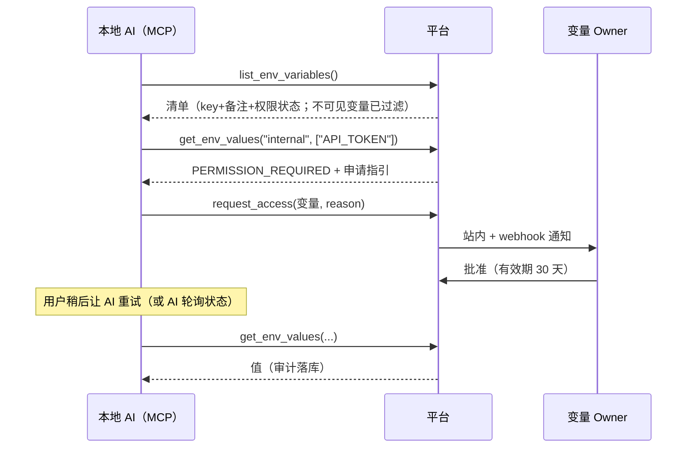

# easy-agent-team 产品设计文档

> 版本：v0.1（设计稿）
> 状态：待评审
> 本文基于最初的需求构思整理、补全而成，补充的设计决策在文中以「💡 设计说明」标出，可以按需推翻。

---

## 1. 产品概述

### 1.1 背景与问题

AI 编程助手（Claude Code 等）已经进入日常工作，但团队协作层面存在几个断层：

1. **能力散落**：Skill、MCP 配置、环境变量、数据库连接信息散落在每个人的本地和聊天记录里，没有统一出口。市面上的工具多面向「人人平等的协作」，缺少「**少数人开发能力 → 在权限管控下分发给其他有权限的人**」这种模式的产品。
2. **权限失控**：密钥要么完全共享（安全风险），要么完全不可见（AI 连"存在什么配置"都不知道，无从下手）。
3. **知识断层**：
   - 不懂技术的同事，听不懂 AI 提出的技术问题，卡住就只能放弃；
   - 别人的 AI 在工作中依赖**你的项目**的代码约定或领域知识，而这些知识只在你脑子里。
4. **基础设施门槛**：日常小项目也需要数据库、需要部署，但让每个成员自己申请运维资源成本太高。

### 1.2 产品定位

**面向单个团队内部使用**的 AI 能力集中管理与分发平台。

- 服务对象是团队的日常工作项目，**不是企业核心生产系统**——满足日常使用即可，不做过度设计（如数据库不搞多实例、部署不搞多集群）。
- 平台自身也通过 MCP / CLI 暴露能力，让成员本地的 AI 成为平台的一等公民用户。

### 1.3 核心理念

| 理念 | 含义 |
|---|---|
| **能力即资源** | Skill、MCP 配置、环境变量、数据库账号、部署能力，统一抽象为「可授权、可分发的资源」 |
| **元数据公开、取值受控** | 默认让 AI 能"看见清单、看懂用途"，但取值需要权限；无权限时引导走申请流程，而不是无声失败 |
| **AI 是一等用户** | 所有面向人的能力（查配置、要权限、问问题）都有对应的 MCP 工具，AI 可以自助完成 |
| **求助产生知识** | 一次求助的答案可以沉淀为 Skill 经验，让同样的问题不再问第二遍 |

### 1.4 名词约定

| 名词 | 说明 |
|---|---|
| 平台 / 控制台 | Web 管理端 |
| CLI | 命令行工具，暂定命令名 `eat`（easy-agent-team 缩写） |
| MCP Server | 随 CLI 一起分发的 MCP 服务，本地 AI 通过它访问平台 |
| Skill | 一段可被 AI 加载的能力说明（对应 Claude Code 的 skill 目录形态） |
| 角色模板 | 管理员预定义的「能力套餐」：一组 Skill + MCP 配置 + 环境引用 |
| 求助（Help Request） | 用户或 AI 向团队内的人发起的提问 |
| 经验（Experience） | 由求助沉淀出来的可复用知识，以 Skill 形式分发 |

---

## 2. 角色与用户故事

### 2.1 平台角色

| 角色 | 权限概述 |
|---|---|
| **管理员（Admin）** | 管理用户、角色模板、数据库实例、Dokploy 接入；可管理所有资源 |
| **成员（Member）** | 使用被授权的资源；可创建自己的资源（个人 Skill、环境等）并成为其 Owner |
| **资源 Owner** | 某个具体资源的创建者/作者，对该资源有完全管理权（含授权他人、审批申请） |

💡 设计说明：团队内部产品，两级平台角色 + 资源级 Owner 已经够用，不引入复杂的 RBAC 组、部门树。资源授权直接授到「用户」粒度。

### 2.2 典型用户故事

**能力建设者（开发者 A）**
- 我开发了一套「运营周报生成」Skill，发布到平台并授权给运营组的 3 个同事，他们 `eat sync` 一下就能用。
- 我维护的项目有一堆约定，我把 Skill 配置为「允许求助」，别人的 AI 遇到我项目的问题会直接来问我，而不是瞎猜。
- 同事的 AI 需要测试库账号，我在控制台点一下分配，账号自动以环境变量形式下发给他，我不用把 root 密码发到群里。

**不懂技术的同事（运营 B）**
- 我在平台选了「运营」角色模板，本地 AI 就装好了该有的 Skill 和配置。
- AI 问我「这个接口的鉴权方式是什么」，我完全听不懂——我让 AI 自己去平台求助，它找到了这个接口所属 Skill 的作者，作者回了一句，AI 继续干活。

**普通开发成员（开发者 C）**
- 我的 AI 想调用公司内部服务，先 `eat env list` 看到有个 `INTERNAL_API_TOKEN`，备注写着用途；拉取值时提示无权限，AI 直接发起申请，Owner 批准后我重新拉取即可。
- 我写了个内部小工具，`eat deploy` 一下，平台先跑前置检查再调 Dokploy 部署，不用自己碰服务器。

**乐于助人的资深同事（D）**
- 我把自己登记进「可求助列表」，描述写「熟悉支付对账、内部 ERP 系统」，并配了飞书 webhook。别人的 AI 遇到相关问题会找到我，我手机上直接收到提醒。
- 回答完一个好问题，我把它沉淀为公开经验，以后同类问题 AI 自己翻经验库就够了。

---

## 3. 功能设计

## 3.1 用户与认证

- **账号体系**：管理员创建账号或开放注册审批；单团队模式，不做多租户。
- **Web 登录**：账号密码（可后续接入团队现有 SSO，非 MVP）。
- **CLI / MCP 登录**：
  - `eat login` 走**设备码授权**：CLI 显示一个链接和短码，用户在浏览器登录确认，CLI 获得长期 Token；
  - Token 可在控制台查看、命名、吊销，支持有效期；
  - MCP Server 复用 CLI 的本地凭证（`~/.eat/credentials`），无需单独登录。
- **审计**：登录、Token 签发/吊销均记审计日志。

## 3.2 Skill 管理与分发

### 3.2.1 Skill 实体

每个 Skill 包含：

| 字段 | 说明 |
|---|---|
| 名称 / 标识 | 全局唯一 slug，落地为本地 skill 目录名 |
| 描述 | 供人和 AI 阅读的用途说明（即 skill 的触发描述） |
| 内容 | SKILL.md 正文 + 可选附属文件 |
| 作者（Owner） | 创建者 |
| **是否允许求助** | 开启后，该 Skill 成为求助系统的一个「求助入口」，问题会路由给作者（见 3.5） |
| 可见性 | `团队可见`（默认，人人可订阅）/ `定向授权`（仅授权用户可见可订阅）/ `私有`（仅自己） |
| 来源类型 | `手工创建` / `经验沉淀`（由求助沉淀而来，见 3.6） |
| 版本 | 每次保存产生新版本号，保留历史 |

### 3.2.2 个人 Skill 库与角色模板

用户拿到 Skill 有三条路径：

1. **自建**：在平台上创建个性化 Skill（私有或分享）。
2. **订阅**：浏览团队 Skill 市场，订阅他人分享的 Skill。
3. **角色模板**：管理员预定义角色模板（如「运营」「测试」「客服」），一个模板 = 一组 Skill + 一组 MCP 配置 + 一组环境引用。用户在个人设置里**选择自己的模板**，模板内容自动进入其同步范围。

规则：

- 用户可同时叠加「模板内容 + 个人订阅 + 自建」，冲突时按 slug 去重、个人自建优先；
- 模板由管理员维护，模板更新后成员在下次 `eat sync` 时自动获得更新；
- 用户可在模板基础上**排除**个别不想要的条目。

### 3.2.3 同步机制（CLI）

- `eat sync`：将当前用户的有效 Skill 集合落地到本地（默认 `~/.claude/skills/`，可配置项目级目录），同时生成/更新 MCP 配置；
- 采用「平台为准」的单向同步：本地被用户手工改过的沉淀目录会提示冲突，`--force` 覆盖；
- 每个落地的 skill 目录带 `.eat-meta.json` 记录来源与版本，便于增量更新与清理已退订项。

💡 设计说明：不做双向同步。个人确实要改的 Skill，引导在平台上改（平台是唯一事实源），避免版本发散。

### 3.2.4 MCP 配置分发

平台同时管理「团队可用的 MCP Server 配置」：

- 管理员或成员登记 MCP 配置（名称、传输方式、URL/命令、说明、所需环境变量引用）；
- 授权模型与 Skill 一致；配置中的敏感字段（token）以**环境变量引用**方式声明，实际取值走环境变量的权限体系（见 3.3），实现一份权限模型管到底；
- `eat sync` 时按用户权限渲染出 `.mcp.json` 片段。

## 3.3 环境变量管理

### 3.3.1 结构

```
环境（Environment）
 ├── 备注（供人和 AI 理解这个环境是干嘛的）
 └── 变量（Variable）×N
      ├── Key / Value（Value 加密存储）
      ├── 备注（这个变量的作用，AI 会读）
      ├── 授权名单（哪些用户可读取值）
      └── 无权限时是否可见（默认：可见）
```

- 环境示例：`公司内部服务`、`测试数据库`、`第三方 SaaS`；
- 环境有 Owner（创建者），Owner 和 Admin 可管理变量与授权。

### 3.3.2 可见性与取值的分离（核心设计）

这是本模块的核心：**「知道存在」和「拿到值」是两级权限**。

| 状态 | 清单中可见（key + 备注） | 可读取值 |
|---|---|---|
| 已授权 | ✅ | ✅ |
| 未授权 + 变量配置为「无权限可见」（默认） | ✅（明确标注"无权限"） | ❌，返回结构化错误并引导申请 |
| 未授权 + 变量配置为「无权限不可见」 | ❌ | ❌ |

效果：本地 AI 想找一个配置时，先 `list` 拉清单——它能**看懂每个变量的作用**（靠备注），确认目标后再取值；若无权限，系统返回：

```json
{
  "error": "PERMISSION_REQUIRED",
  "variable": "internal-services/INTERNAL_API_TOKEN",
  "message": "你没有读取该变量值的权限",
  "how_to_request": "调用 request_access 工具发起权限申请，Owner 批准后重试"
}
```

### 3.3.3 权限申请与审批

原始构思里提到「提醒它没有权限，需要申请权限」，这里补全整个闭环：

1. 用户或 AI 对一个或多个变量发起**权限申请**（附申请理由）；
2. 申请通知资源 Owner（站内 + Owner 配置的 webhook）；
3. Owner 在控制台一键批准/驳回，批准时可设**授权有效期**（永久 / 7 天 / 30 天…）；
4. 申请者（及其 AI）可查询申请状态，批准后重新拉取即可；
5. 全程记审计日志。

### 3.3.4 安全要求

- 变量值加密存储（信封加密：主密钥 KEK 来自部署环境变量，数据密钥 AES-256-GCM）；
- 控制台默认打码显示，点击查看/复制记审计；
- **每一次值的读取（含 CLI/MCP 拉取）都记审计日志**：谁、何时、拉了什么；
- 支持值轮换：更新值后旧值不可再拉取，审计可追溯变更历史。

## 3.4 数据库账号分配管理

定位：满足团队成员**日常工作项目**用库需求，不服务生产级核心项目，因此：

- **不做多实例编排**：管理员登记若干共享数据库实例（如一台 MySQL、一台 PostgreSQL），够用即可；
- 隔离粒度为「实例内的库 + 账号」：为每个申请创建独立 database/schema 和专属账号，权限限定在自己的库内。

流程：

1. 管理员登记实例（类型、连接地址、管理凭证——凭证同样加密存储）；
2. 成员发起「数据库申请」（选实例、填项目名和用途）或由管理员直接分配；
3. 平台在实例上自动执行：建库 + 建账号 + 授权（也支持纯手工登记模式，兼容不能自动执行的场景）；
4. **分配结果自动生成为一个环境（或环境变量组）**：`DB_HOST / DB_PORT / DB_NAME / DB_USER / DB_PASSWORD`，仅授权给申请人——数据库账号的下发、拉取、审计**完全复用环境变量体系**；
5. 支持回收：禁用账号、（确认后）删除库。

💡 设计说明：「分配结果 = 一组环境变量」是关键复用点：不为数据库账号单独造一套拉取/授权/审计通道。

## 3.5 求助系统（人机协作核心）

### 3.5.1 要解决的两个场景

1. **同事不懂技术**：AI 向用户提出技术问题，用户听不懂 → 用户让 AI 去平台求助真人；
2. **跨项目知识依赖**：A 的 AI 干活时依赖 B 的项目的代码约定/领域知识 → AI 直接向 B（该项目 Skill 的作者）求助。

发起方可以是 **AI 自主发起**（干活中遇阻），也可以是**用户主动让 AI 发起**。

### 3.5.2 求助对象（两类入口）

**① Skill 作者**
- 每个 Skill 可配置「是否允许求助」（默认关闭）；
- 开启后，使用该 Skill 的 AI 遇到相关问题，可直接对着这个 Skill 发起求助，路由给作者。

**② 可求助者列表（Helper Registry）**
- 每个用户可**把自己登记**进可求助列表，登记内容：
  - **能力描述**：一段自然语言，描述自己擅长的领域——**这段描述会被 AI 读取，用于选择向谁求助**；
  - **Webhook 告警地址**（可选）：新求助/新消息推送到这里（飞书、钉钉、企业微信、Slack 或任意 HTTP 端点）；
  - 接单状态：`可接单` / `勿扰`（临时下线，不出现在 AI 的候选名单里）。

AI 发起求助时可以：指定 skill、指定具体 helper，或者传 `auto` 由 AI 先 `list_helpers` 读描述后自选。

### 3.5.3 求助请求的生命周期



- 每个请求有**请求 ID** + 标题 + 问题描述 + 可选上下文（代码片段、报错信息——由 AI 组织，注意提示不要携带密钥）；
- 支持**多轮对话**：请求下是一串消息，双方都可追加；
- 创建与每次回复都会：落库 + 推送对方的 webhook + 站内通知；
- **可见性：默认仅求助者与被求助者两人可见**（含管理员也不可见正文，管理员仅见统计——见开放问题 §10）；
- AI 侧通过 `get_help_request(id)` 读取最新回复；CLI 也可 `eat ask show <id>`。

### 3.5.4 防骚扰

- AI 发起求助有频率限制（如每用户每小时 N 条），超限提示先自行尝试；
- 求助创建前强制要求填写「已经尝试过什么」，减少伸手党问题；
- helper 可将请求一键转给更合适的人（重新指派）。

## 3.6 经验沉淀

一次有价值的求助不应只解决一次问题。

### 3.6.1 沉淀规则

- 一个 `resolved` 的求助可以被**沉淀为经验（Experience）**；
- 沉淀时可配置：
  - **是否公开**：公开 → 进入团队经验库，人人可见可订阅；不公开 → **仅求助双方可见**；
  - **沉淀给谁**：`沉淀给求助者` / `沉淀给被求助者` / 两者（多选）；
- **编辑权限：仅被求助者（回答者）可修改经验内容，求助者无权修改**——保证知识出自懂的人之手；
- 沉淀操作本身由被求助者执行（求助者可发起"申请沉淀"提醒对方）。

### 3.6.2 沉淀形式：经验即 Skill

- 沉淀时，系统（可用 AI 辅助）把 Q&A 整理成一个 Skill：描述 = 问题的适用场景，正文 = 结论与操作要点，并保留对原求助的引用；
- 该 Skill 的来源类型为 `经验沉淀`，Owner 为被求助者；
- 沉淀目标用户（求助者/被求助者）的个人 Skill 库自动加入该 Skill，下次 `eat sync` 落地本地；
- **引用式而非拷贝式**：被求助者后续修改经验，所有订阅方 sync 后自动拿到最新版；
- 公开经验可被全团队检索（控制台 + MCP `search_experiences`），AI 遇到问题时**应先搜经验库再发起求助**（写进平台自带的基础 Skill 里）。

### 3.6.3 求助 → 沉淀完整流程



## 3.7 部署托管（Dokploy 集成）

定位：让成员（及其 AI）能自助部署日常小项目，**平台不自建部署系统，挂载 Dokploy、通过其 API 操作**。

### 3.7.1 功能

- 管理员登记 Dokploy 实例（API 地址 + Token，加密存储）；
- 平台内建「项目（Project）」实体：绑定 Git 仓库 + Dokploy 上的 application，配置项目成员（谁可部署）；
- 部署操作：触发部署、查看部署状态与日志、回滚（映射 Dokploy API 能力）；
- CLI/MCP：`eat deploy` / `trigger_deploy` / `get_deploy_logs`，AI 可自助部署并根据日志自查失败原因。

### 3.7.2 代码前置检查（Pre-deploy Checks）

部署前的强制闸门，检查通过才调用 Dokploy API：

- 每个项目可配置检查项，MVP 内置：
  - **密钥泄漏扫描**（防止把平台下发的密钥硬编码提交）；
  - **构建可通过**（lint / build / test，按项目配置的命令）；
- 检查执行方式（按接入成本递进）：
  1. **平台侧 runner**：平台拉代码在隔离容器里跑检查（MVP 推荐，简单直接）；
  2. **CI 回调模式**：项目已有 CI 的，由 CI 完成检查后回调平台登记结果；
- 检查结果落库，部署记录关联检查报告；失败时 AI 能读到失败原因去修。

## 3.8 CLI 与 MCP 能力总览

CLI 与 MCP Server 同一个包分发（`npm i -g @team/eat`），MCP Server 由 `eat mcp` 启动。

### CLI 命令

| 命令 | 功能 |
|---|---|
| `eat login` / `eat logout` / `eat whoami` | 设备码登录、登出、查看当前身份 |
| `eat sync` | 同步 Skill + MCP 配置到本地（模板 + 订阅 + 自建 + 沉淀经验） |
| `eat env list [env]` | 列出可见环境与变量清单（key + 备注 + 权限状态） |
| `eat env pull <env> [--format dotenv]` | 拉取有权限的变量值，写入 `.env` 或输出 |
| `eat env request <env>/<KEY> --reason "..."` | 发起权限申请 |
| `eat ask create / show / list / reply` | 发起求助、查看回复、追问 |
| `eat deploy [project]` / `eat deploy logs` | 触发部署、看日志 |
| `eat db list` | 查看自己名下的数据库账号（引导用 env pull 取凭证） |

### MCP 工具

| 工具 | 说明 |
|---|---|
| `list_env_variables` | 变量清单（含备注与权限状态），供 AI 认路 |
| `get_env_values` | 取值；无权限返回结构化 `PERMISSION_REQUIRED` |
| `request_access` | 发起权限申请 |
| `get_access_request_status` | 查询申请状态 |
| `search_experiences` | 搜索经验库（求助前先搜） |
| `list_helpers` | 列出可求助者及其能力描述（含允许求助的 Skill 作者） |
| `create_help_request` | 发起求助（指定 skill / helper / auto） |
| `get_help_request` / `reply_help_request` | 读取回复、追问 |
| `trigger_deploy` / `get_deploy_status` / `get_deploy_logs` | 部署三件套 |

💡 设计说明：平台随角色模板内置一个「平台使用指南」基础 Skill，教 AI 正确的行为序列（先搜经验 → 再求助；先 list → 再 pull → 无权限则申请），这比在每个工具描述里堆规则更有效。

## 3.9 通知与 Webhook

- 平台级出站 webhook：求助创建/回复、权限申请/审批结果、部署完成/失败；
- 用户级 webhook：helper 登记时配置的告警地址（3.5.2）、个人通知偏好；
- 通用 JSON + HMAC-SHA256 签名头；针对飞书/钉钉/企业微信提供消息模板适配；
- 失败重试（指数退避，最多 5 次），控制台可查推送记录。

---

## 4. 权限模型汇总

| 资源 | 无权限者可见性 | 授权方式 | 审批人 |
|---|---|---|---|
| Skill（团队可见） | 元数据+内容可见 | 订阅即用 | — |
| Skill（定向授权） | 不可见 | Owner 授权 | Owner |
| 环境变量 | 默认 key+备注可见（可关）；值不可见 | Owner 授权 / 申请审批，可带有效期 | Owner / Admin |
| 数据库账号 | 仅本人 | 申请或管理员分配 | Admin |
| 求助请求 | 仅求助双方 | — | — |
| 经验（非公开） | 仅求助双方 | 沉淀时指定 | 被求助者 |
| 经验（公开） | 全员 | 订阅即用 | — |
| 部署项目 | 项目成员 | Owner 添加成员 | 项目 Owner |
| 角色模板 | 全员可选用 | 管理员维护 | Admin |

不变式（实现时需保证）：

1. 变量**值**永远不出现在无权限的响应里（包括报错信息、日志、审计详情对第三方的展示）；
2. 经验的编辑入口只对被求助者开放；求助者对沉淀内容只读；
3. 求助正文对双方之外的任何人（含 Admin）不可见；
4. 所有敏感读取（取值、查看密钥、拉取数据库凭证）必须落审计。

---

## 5. 领域模型与数据设计

### 5.1 领域模型总览



### 5.2 核心表（字段级摘要）

**user**：id, name, email, role(admin|member), password_hash, status, created_at

**api_token**：id, user_id, name, token_hash, expires_at, last_used_at, revoked_at

**skill**：id, slug, name, description, owner_id, visibility(team|granted|private), allow_help(bool), source(manual|experience), current_version_id, created_at

**skill_version**：id, skill_id, version, content(SKILL.md 正文), files(jsonb), changelog, created_at

**skill_subscription**：user_id, skill_id, source(template|manual|experience), excluded(bool)

**role_template**：id, name, description, created_by —— **template_item**：template_id, item_type(skill|mcp_config|environment), item_id

**mcp_config**：id, slug, name, description, transport, config(jsonb, 敏感字段写作 `${env:ENV/KEY}` 引用), owner_id, visibility

**environment**：id, slug, name, description, owner_id, source(manual|db_assignment)

**env_variable**：id, environment_id, key, value_encrypted, description, visible_without_permission(bool, 默认 true), version, updated_at

**variable_grant**：id, variable_id, user_id, granted_by, expires_at, created_at
（支持环境级批量授权：grant 亦可挂 environment_id 表示整环境授权）

**access_request**：id, requester_id, target_type(variable|environment|db), target_ids, reason, status(pending|approved|rejected), decided_by, decided_at, grant_expires_at

**db_instance**：id, name, engine(mysql|postgres), host, port, admin_credentials_encrypted, note
**db_assignment**：id, instance_id, user_id, db_name, db_user, purpose, environment_id(生成的环境), status(active|disabled|deleted), created_at

**helper_profile**：user_id, description(AI 会读取), webhook_url, webhook_secret, available(bool)

**help_request**：id, requester_id, helper_id, skill_id(nullable，经 skill 入口发起时), title, description, context, tried(已尝试内容), status(open|answered|resolved|closed), created_at
**help_message**：id, request_id, sender_id, content, created_at

**experience**：id, help_request_id, skill_id(沉淀生成的 skill), public(bool), granted_to_requester(bool), granted_to_helper(bool), created_by(=helper), updated_at

**project**：id, name, repo_url, dokploy_app_id, owner_id —— **project_member**：project_id, user_id
**deployment**：id, project_id, triggered_by, status(pending|checking|deploying|success|failed), dokploy_ref, created_at
**precheck_result**：id, deployment_id, check_type(secret_scan|build|custom), status, report, created_at

**audit_log**：id, actor_id, actor_token_id, action, target_type, target_id, meta(jsonb), ip, created_at

**webhook_delivery**：id, event_type, target_url, payload_digest, status, attempts, last_attempt_at

---

## 6. 关键流程

### 6.1 AI 获取环境变量（含无权限申请）



### 6.2 部署流程

`eat deploy` → 平台创建 deployment(pending) → 平台 runner 拉代码跑前置检查 → 全部通过 → 调 Dokploy API 触发部署 → 轮询/webhook 回传状态 → 成功/失败通知触发人。任一检查失败则终止，AI 可读检查报告自行修复后重试。

---

## 7. 技术架构建议

### 7.1 总体架构

```
┌─────────────┐   ┌──────────────┐   ┌────────────────┐
│  Web 控制台  │   │  CLI (eat)   │   │ 本地 AI + MCP   │
└──────┬──────┘   └──────┬───────┘   └──────┬─────────┘
       │        HTTPS / REST API（Token 鉴权）│
┌──────┴──────────────────┴──────────────────┴─────────┐
│                    平台服务（单体）                     │
│  认证/授权 · Skill · 环境变量 · 求助 · 经验 · 部署编排   │
│  审计 · Webhook 分发 · 前置检查 Runner 调度             │
└──────┬───────────────┬───────────────┬───────────────┘
   PostgreSQL      检查 Runner       外部系统
  （业务+审计）   （隔离容器跑检查）   Dokploy API / 团队 DB 实例 / IM webhook
```

### 7.2 选型建议

| 层 | 建议 | 理由 |
|---|---|---|
| 平台服务 | **Next.js 全栈**（控制台 + API 同仓）或 NestJS+React 分离 | 团队内部工具，单体最省事；一个容器丢进 Dokploy |
| 数据库 | PostgreSQL | jsonb 灵活、单库承载业务+审计足够 |
| ORM | Drizzle / Prisma | 迁移管理 |
| CLI + MCP | TypeScript 单包，npm 分发；MCP 用官方 `@modelcontextprotocol/sdk`（stdio） | 与前后端同栈；`eat mcp` 即起 server |
| 加密 | 信封加密，KEK 走部署环境变量，AES-256-GCM | 无需引入外部 KMS |
| 检查 Runner | 平台内起 Docker 容器执行（同机） | 日常项目规模够用 |
| 部署 | 平台自身用 Docker 部署在 Dokploy 上 | 自举，吃自己的狗粮 |

---

## 8. 安全设计要点

1. **密钥永不下发明文到无权限方**：包括错误消息、日志、webhook payload（webhook 只带事件与链接，不带值）；
2. **传输**：全程 HTTPS；CLI Token 仅存本地用户目录（0600）；
3. **存储**：变量值、数据库管理凭证、Dokploy Token、webhook secret 全部加密落库；
4. **审计**：敏感读取/授权变更/部署操作全量审计，控制台可按资源、按人检索；
5. **提示注入面**：求助内容、helper 描述、经验正文都会被 AI 读取——控制台展示时提示"此内容会被 AI 读取"，MCP 返回中以数据段包裹并注明来源，不作为指令执行（写进平台基础 Skill 的安全准则）；
6. **防泄漏闭环**：部署前置检查内置密钥扫描，扫描规则联动平台内登记的变量值指纹（对值做不可逆指纹匹配，不存明文规则）。

---

## 9. MVP 与路线图

### P0 —— 最小可用（价值闭环：集中管理 + 权限分发）

- 用户/登录/Token、设备码授权
- 环境变量管理：环境/变量 CRUD、备注、授权、无权限可见性开关、申请审批闭环
- Skill 管理：创建、版本、团队可见/私有、订阅
- CLI + MCP：login / sync / env list / env pull / request_access
- 审计日志（敏感读取）

### P1 —— 人机协作（求助与经验）

- Helper 登记（描述 + webhook + 勿扰）
- Skill「允许求助」入口
- 求助全流程（创建/多轮/状态机/双方可见性）+ webhook 推送
- 经验沉淀（公开性、沉淀对象、helper 独占编辑、经验即 Skill 分发）
- MCP：search_experiences / list_helpers / create_help_request / get_help_request

### P2 —— 能力扩展

- 角色模板（管理员定义、成员选用、模板同步）
- MCP 配置分发（含环境变量引用渲染）
- 数据库账号分配（实例登记、自动建库建号、以环境变量形式下发、回收）

### P3 —— 部署托管

- Dokploy 接入、项目/成员、部署触发与日志
- 前置检查 Runner（密钥扫描 + 构建检查），CI 回调模式
- MCP 部署三件套

---

## 10. 开放问题（需要拍板）

1. **管理员对求助内容的可见性**：本设计取"管理员也不可见正文，仅见统计"。若团队需要合规审查，可加"双方同意后可导出"机制——需要拍板。
2. **CLI/平台命名**：`eat` 只是占位，是否要正式命名？
3. **求助的响应时效**：是否需要"超时未响应自动转派/升级"机制？MVP 建议不做，靠 webhook 提醒 + 人肉催。
4. **经验沉淀是否引入 AI 自动整理**：建议 P1 先做"手工编辑 + 模板"，AI 辅助整理放 P2（平台侧需要配一个模型调用）。
5. **本地已有 skill 的纳管**：是否提供 `eat skill push` 把本地已写好的 skill 上传到平台？建议做，成本低、对能力建设者体验重要。
