# 界面截图与命令行录屏（全集）

README 里挑了一部分，这里是全部。所有画面来自同一份可复现的演示数据，生成方式见
[`scripts/demo/README.md`](../scripts/demo/README.md)：数据经平台自己的 API 写入，
部署、构建日志、数据库账号都是真跑出来的，命令行录屏是把命令真执行一遍录的。

演示里的这支团队：管理员，李维（后端 / 能力建设者），周琪（运营），孙浩（前端），
吴敏（新同事），郑楠（数据）。

## 命令行

### 新同事的第一天：登录 → 同步

设备码登录，浏览器里点一次同意；`eat sync` 把订阅的 Skill 落到 `~/.agents/skills` 并软链到
`~/.claude/skills`，同时渲染 MCP 配置——其中因为没权限而解析不了的引用会被逐条列出来，
并直接给出该执行的申请命令。

### 缺权限：清单看得见，值看不见

无权限时不是静默失败，而是告诉 AI 该申请什么、命令怎么写。Owner 批准后再拉一次即可。

### 缺信息：让 AI 自己去问人

`eat ask targets` 列出可求助的人与「可就此 Skill 求助」的作者，AI 依据能力描述自己选。

### 部署门禁：本地扫描拦下密钥

除了通用规则与 `.env` 误提交，还会把文件里的字符串与**平台下发过的密钥指纹**比对——
这条命中的就是刚 `eat env pull` 下来的那个 token。

### 部署失败：真实报错就在平台里

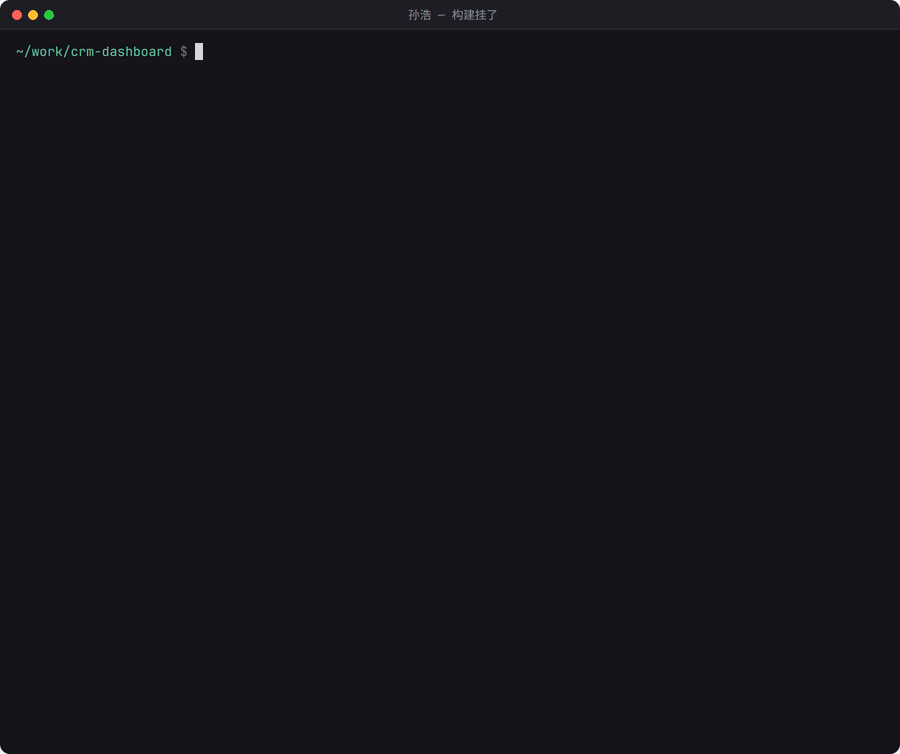

不用登部署后台翻日志，`eat app build-logs` 直接给到构建的原始输出。

### 修好上线

> 画面里 `eat app status` 的「⚠ 归属按时间推断」是对接的 Dokploy v0.30.5 的已知行为：
> 它在构建结束时会用提交信息覆盖构建记录的描述，平台写进去的认领标记因此消失。
> 详见 README 的 [Dokploy 版本兼容性](../README.md#dokploy-版本兼容性)。

## 控制台

### 环境变量

变量元数据（key、备注）默认全员可见，值需要授权；敏感值加密存储并打码，非敏感值对有权限者直接明文可见。
页内 tabs 分「变量 / 授权 / 申请」。

### Skill 与经验

`exp-` 开头的是求助解决后沉淀下来的经验；版本号由服务端在每次 `eat skill push` 时递增。
内置的平台使用指南（`eat-platform-guide`）不在这张表里——它不入库，`eat sync` 时直接注入到每个成员本地并置于首位。

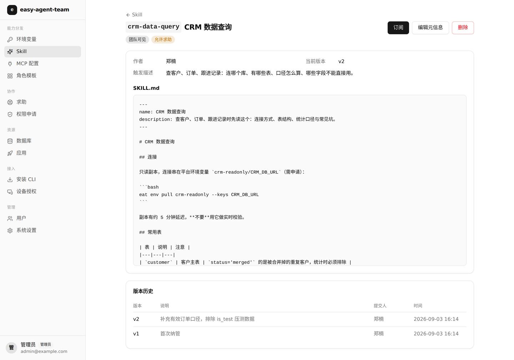

### MCP 配置与角色模板

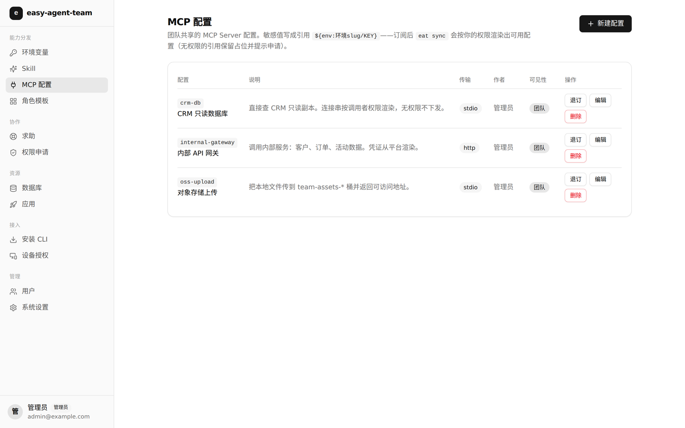

配置里写 `${env:环境/KEY}`，下发时按该成员的权限渲染，无权限就不下发明文。

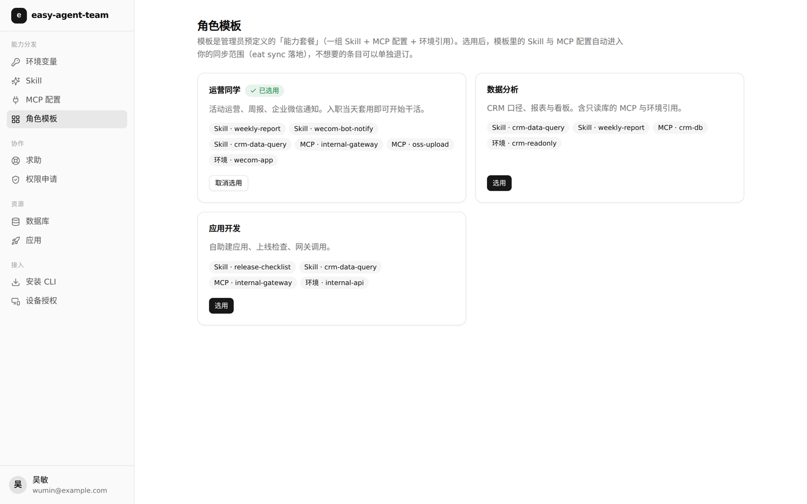

### 求助与经验沉淀

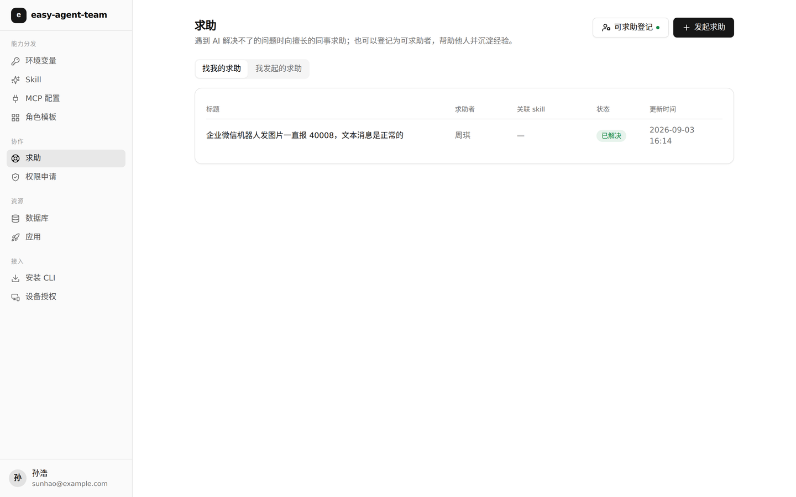

### 数据库账号

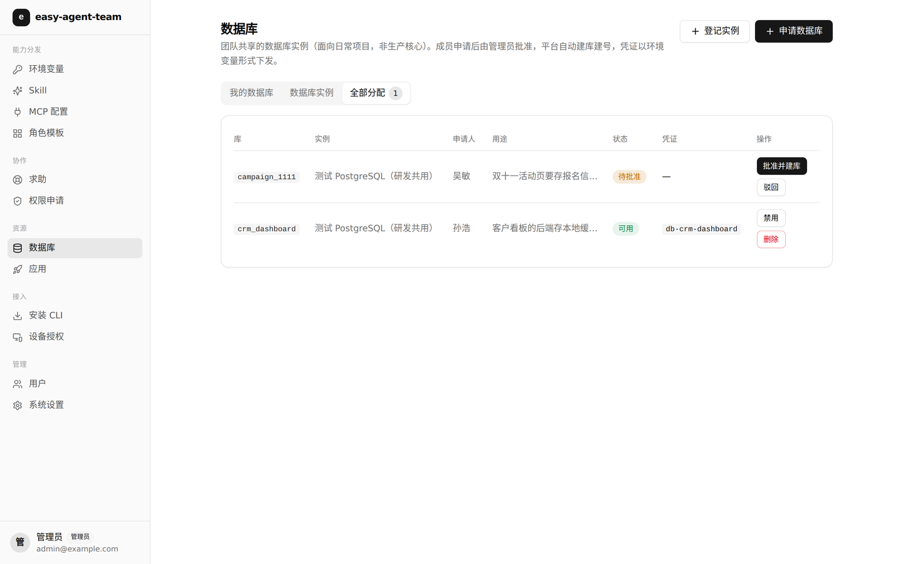

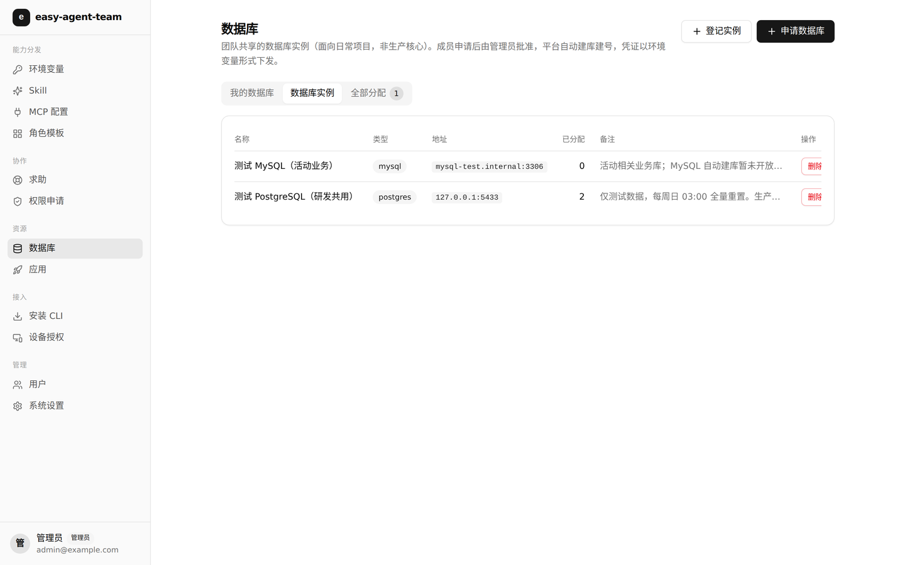

审批通过后平台在实例上真实建库建号，凭证自动生成为一组环境变量，其中只有 `DB_PASSWORD` 是敏感值。

### 应用与部署

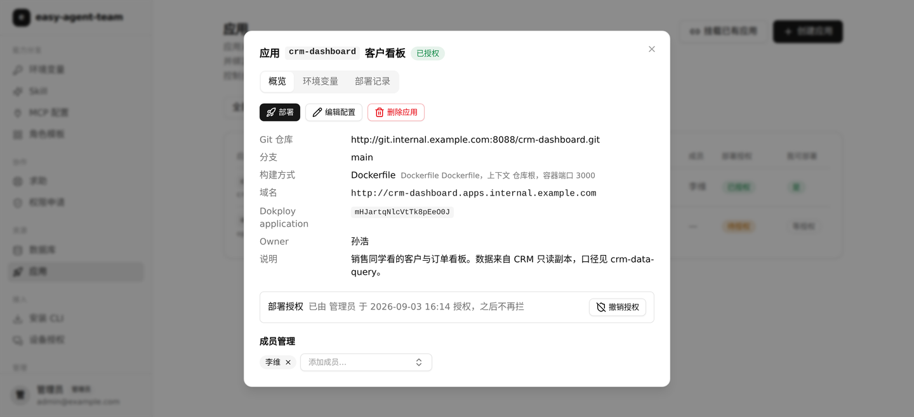

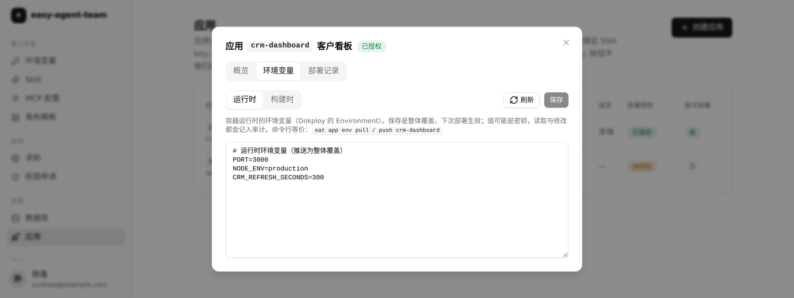

运行时 env 与构建时 Build Args 分开维护，推送为整体覆盖、只回 key 级差异。

三条记录分别是：直接在部署后台触发的（标「未经平台扫描」，门禁被绕过因此可见）、
平台触发且构建成功的、平台触发但构建失败的。

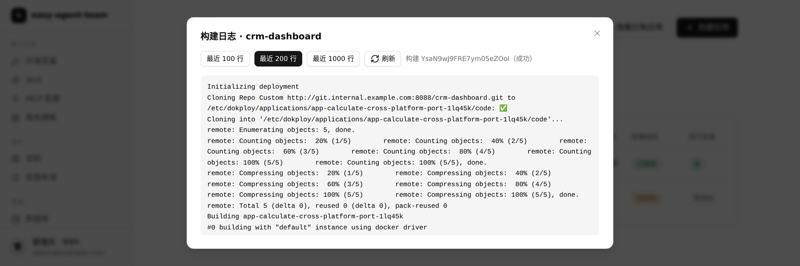

### 管理

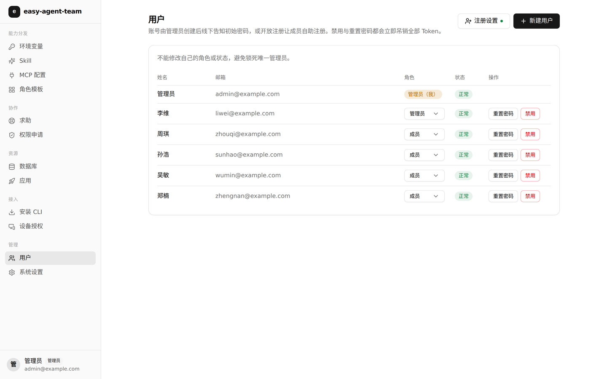

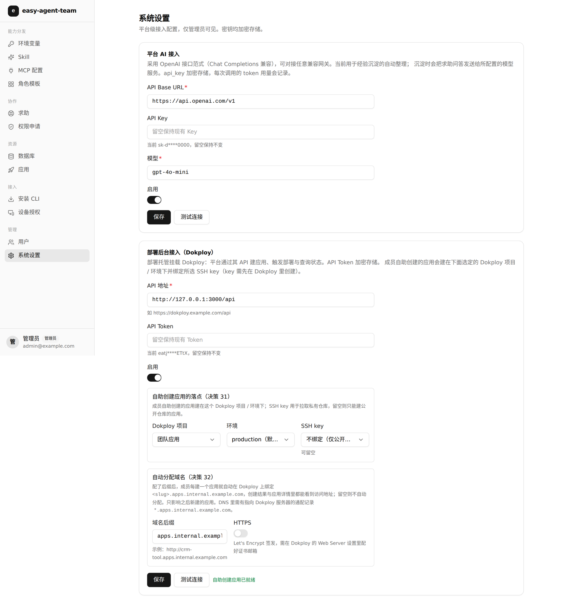

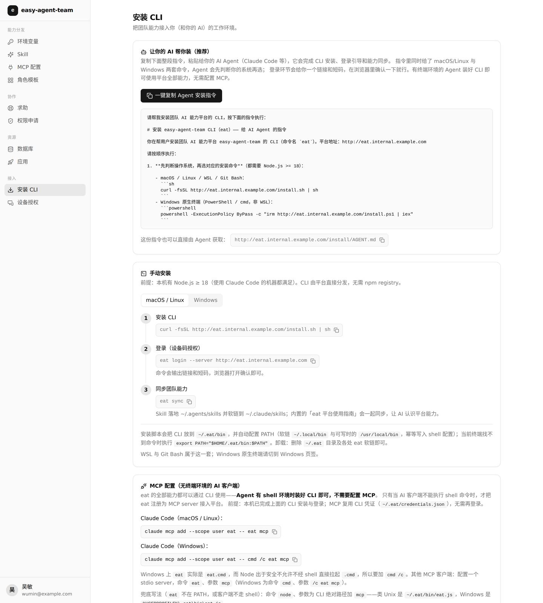

安装页按 UA 分 macOS/Linux 与 Windows 两个页签，并给出可以直接丢给 AI 的一段安装指令。

### 移动端

  
  

桌面用左侧分组侧边栏，移动端换抽屉导航，表格按断点隐藏次要列。
